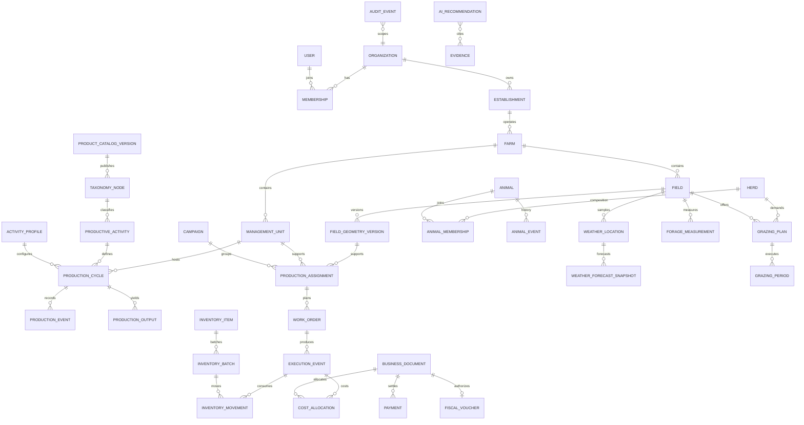

# Reglas de negocio y modelo de datos

## Reglas transversales

- `RN-CORE-001`: toda entidad de negocio pertenece a una organización; el servidor deriva y valida el `tenant_id`.
- `RN-CORE-002`: fecha efectiva y fecha de registro son distintas y obligatorias en eventos.
- `RN-CORE-003`: cada dato conserva origen: manual, importación, dispositivo, integración, cálculo o IA.
- `RN-CORE-004`: hechos confirmados se rectifican mediante reversa/ajuste; nunca se sobrescriben sin historia.
- `RN-CORE-005`: importaciones y reintentos usan claves idempotentes.
- `RN-CORE-006`: dinero usa decimal, moneda ISO, cotización, fecha y fuente; nunca punto flotante.
- `RN-CORE-007`: cantidades conservan valor/unidad original y conversión aplicada.
- `RN-CORE-008`: documentos conservan hash, versión, autor, fecha, clasificación y relación de negocio.
- `RN-CORE-009`: todo cambio sensible registra actor, organización, recurso, acción, antes/después permitido, IP/dispositivo y correlación.

## GIS

- `RN-GIS-001`: lote productivo, parcela catastral y establecimiento sanitario son entidades distintas.
- `RN-GIS-002`: la geometría activa debe ser válida; límites de tamaño y vértices son configurables.
- `RN-GIS-003`: superficie declarada y calculada coexisten; una diferencia fuera de tolerancia genera advertencia.
- `RN-GIS-004`: cada edición de límites crea una versión con vigencia, autor y motivo.
- `RN-GIS-005`: un evento histórico resuelve la versión espacial vigente en su fecha efectiva.
- `RN-GIS-006`: subdivisiones/fusiones mantienen vínculos de predecesor/sucesor.
- `RN-GIS-007`: geometrías simultáneas en conflicto no usan “última escritura gana”.

## Catálogo y núcleo productivo

- `RN-CAT-001`: completitud significa cubrir el 100 % de las entradas de una línea base nacional versionada o registrar una excepción aprobada; no una promesa eterna de exhaustividad.
- `RN-CAT-002`: estar catalogado o tener flujo genérico no equivale a soporte especializado ni cumplimiento regulatorio automatizado.
- `RN-CAT-003`: toda entrada conserva código interno, fuente/código externo, nombre oficial/científico, alias, jerarquía, vigencia, jurisdicción y nivel de soporte.
- `RN-CAT-004`: extensiones de una organización pueden mapearse al catálogo, pero nunca sobrescriben la línea base nacional ni datos de otro tenant.
- `RN-CAT-005`: una entrada usada no se elimina; se inactiva o reemplaza con vínculo de sucesión y conserva históricos.
- `RN-PRD-001`: todo ciclo conserva actividad, sistema, unidad de manejo, perfil y versiones vigentes al momento del evento.
- `RN-PRD-002`: toda actividad admite eventos, cantidades/unidades, productos, costos, documentos y timeline mediante el núcleo común.
- `RN-PRD-003`: una regla especializada solo se ejecuta para perfil, versión y jurisdicción explícitos; ante incompatibilidad se abstiene.
- `RN-PRD-004`: los atributos especializados usan un schema versionado; fecha, cantidad, unidad, fuente, costo, estado, ubicación y evidencia permanecen tipados.
- `RN-PRD-005`: especie/cultivo, propósito, sistema, categoría, estado fisiológico, unidad de seguimiento y producto son dimensiones diferentes.

## Agricultura

- `RN-AGR-001`: una asignación de cultivo referencia campaña, lote/versiones, superficie y vigencia.
- `RN-AGR-002`: una labor confirmada puede consumir inventario e imputar costo una sola vez.
- `RN-AGR-003`: dosis, superficie aplicada y cantidad total deben ser matemáticamente consistentes o justificar diferencia.
- `RN-AGR-004`: una recomendación profesional y su ejecución son registros separados.
- `RN-AGR-005`: cosecha, almacenamiento, entrega y venta son movimientos distintos y conciliables.
- `RN-AGR-006`: prescripciones/recetas oficiales dependen de jurisdicción y profesional habilitado.

## Ganadería

- `RN-GAN-001`: un identificador oficial no se reutiliza entre animales.
- `RN-GAN-002`: el stock a una fecha se deriva de altas, bajas, movimientos y ajustes; no de un contador editable sin historia.
- `RN-GAN-003`: un animal no puede ocupar dos ubicaciones incompatibles en el mismo período.
- `RN-GAN-004`: los cambios de rodeo/categoría conservan composición antes y después.
- `RN-GAN-005`: tratamiento conserva producto/partida, dosis, responsable y período de carencia.
- `RN-GAN-006`: movimientos externos requieren origen, destino, fecha y documentación aplicable.
- `RN-GAN-007`: desde 2026, el diseño debe poder registrar identificación electrónica individual en bovinos/bubalinos/cérvidos alcanzados; no depender solo de totales por categoría.
- `RN-GAN-008`: la evidencia de pastoreo es `OBSERVADO` con forraje medido, `ESTIMADO` con perfil/modelo/supuesto profesional o `SEGURIDAD_INSUFICIENTE` sin agua/parámetros o con restricciones; solo el primer nivel habilita una fecha/capacidad exacta.
- `RN-GAN-009`: con evidencia observada, oferta utilizable (kg MS) = `máx(0, biomasa de entrada − remanente objetivo) × hectáreas aprovechables × factor de utilización`; con evidencia estimada se informan rangos, no una cifra confirmada.
- `RN-GAN-010`: demanda pastoril diaria (kg MS/día) = demanda total configurada del rodeo menos suplemento/reserva efectivamente aportado en materia seca.
- `RN-GAN-011`: días máximos estimados = oferta utilizable / demanda pastoril diaria, redondeado conservadoramente y limitado por máximo de ocupación profesional.
- `RN-GAN-012`: el descanso no es un valor fijo por ubicación; depende de recurso, estación, objetivo, remanente, crecimiento observado y clima, con mínimos/máximos configurados.
- `RN-GAN-013`: sin mediciones suficientes, el sistema muestra escenario o solicitud de relevamiento, no una orden categórica.
- `RN-GAN-014`: cada taxón/especie y categoría usa parámetros propios del perfil; nunca se comparte un porcentaje universal ni se fuerza colmenas, lotes avícolas o acuáticos al modelo de rodeo.

## Clima

- `RN-CLI-001`: pronóstico, reanálisis, estación y observación manual son orígenes diferentes y no se sobreescriben.
- `RN-CLI-002`: cada valor conserva proveedor, modelo, corrida/emisión, punto de grilla, horizonte, unidad y fecha de consulta.
- `RN-CLI-003`: una recomendación referencia el snapshot exacto del pronóstico utilizado.
- `RN-CLI-004`: probabilidad de precipitación y milímetros pronosticados son variables distintas.
- `RN-CLI-005`: lluvia observada local tiene prioridad descriptiva si existe; su ausencia no invalida el pronóstico, pero impide calibración local y debe quedar visible.
- `RN-CLI-006`: datos de suelo/lluvia modelados son contexto zonal, no medición del lote; la interfaz debe rotularlos.
- `RN-CLI-007`: si el dato está vencido o el proveedor falla, se informa degradación y no se fabrican valores.
- `RN-CLI-008`: umbrales de alerta y ventanas de decisión son configurables por actividad/campo.

## Inventario y activos

- `RN-INV-001`: toda existencia surge de movimientos; los ajustes requieren motivo y aprobación configurable.
- `RN-INV-002`: no se permite stock negativo salvo política explícita y alerta visible.
- `RN-INV-003`: cada consumo crítico identifica partida y destino productivo.
- `RN-INV-004`: vencimiento/carencia bloquea o advierte según categoría y política.
- `RN-ACT-001`: costo histórico, valor contable y valor de mercado/gestión son series separadas.
- `RN-ACT-002`: toda valuación estimada indica método, fuente, moneda, fecha y autor.

## Gestión económica y fiscal futuro

- `RN-FIN-001`: operación, documento fiscal, tesorería e imputación económica son capas relacionadas pero independientes.
- `RN-FIN-002`: un cierre bloquea modificaciones; reapertura requiere permiso, motivo y auditoría.
- `RN-FIN-003`: costo indirecto conserva regla y base de prorrateo versionadas.
- `RN-FIN-004`: KPI financieros muestran fórmula, período y método de valuación.
- `RN-FIN-005`: el exporte al contador conserva identificadores estables y trazabilidad al documento; no declara que los datos fueron liquidados o validados fiscalmente.

Las siguientes reglas fiscales quedan documentadas para una fase futura y no forman parte del MVP:

- `RN-FIS-001`: un comprobante no está emitido hasta que ARCA lo autoriza y devuelve CAE.
- `RN-FIS-002`: estados: `BORRADOR → PENDIENTE_ARCA → APROBADO | APROBADO_CON_OBSERVACIONES | RECHAZADO`.
- `RN-FIS-003`: ante timeout/resultado incierto se consulta ARCA antes de reintentar.
- `RN-FIS-004`: emisión serializada por organización + CUIT + punto de venta + tipo; numeración correlativa.
- `RN-FIS-005`: comprobante autorizado no se edita/elimina; se corrige con nota relacionada cuando corresponda.
- `RN-FIS-006`: catálogos fiscales se sincronizan/parametrizan; no se hardcodean reglas mutables.
- `RN-FIS-007`: la Clave Fiscal nunca se solicita ni almacena.

## IA

- `RN-IA-001`: el modelo solo recupera recursos que el usuario puede consultar en ese momento.
- `RN-IA-002`: cálculos críticos se realizan con funciones determinísticas, no con aritmética libre del LLM.
- `RN-IA-003`: toda recomendación contiene evidencia, período, supuestos, confianza y datos faltantes.
- `RN-IA-004`: la IA no emite comprobantes, pagos, aplicaciones, tratamientos ni movimientos oficiales.
- `RN-IA-005`: contenido de documentos es dato no confiable y no puede cambiar instrucciones del sistema.
- `RN-IA-006`: respuestas, fuentes, modelo, versión y feedback se auditan con retención definida.

## Modelo conceptual

## Agregados/entidades principales

- Identidad: `User`, `Organization`, `Membership`, `Role`, `Permission`, `Invitation`, `Authenticator`.
- Territorio: `Establishment`, `OfficialRegistration`, `Farm`, `Parcel`, `Field`, `GeometryVersion`, `InfrastructureFeature`.
- Catálogo: `ProductCatalogVersion`, `ProductCatalogSource`, `TaxonomyNode`, `CatalogAlias`, `JurisdictionApplicability`, `SupportLevel`, `ActivityProfile`, `ActivityProfileVersion`.
- Núcleo productivo: `ProductiveActivity`, `ProductionSystem`, `ManagementUnit`, `ProductionCycle`, `ProductionEvent`, `ProductionOutput`, `ProducedBatch`.
- Operación: `Campaign`, `ProductionAssignment`, `Plan`, `WorkOrder`, `ExecutionEvent`, `Approval`.
- Agricultura: `CropCycle`, `Scouting`, `Prescription`, `Application`, `Harvest`, `ProducedBatch`.
- Ganadería: `Animal`, `OfficialIdentifier`, `Herd`, `HerdMembership`, `AnimalEvent`, `Treatment`, `PastureResource`, `ForageMeasurement`, `GrazingPlan`, `GrazingPeriod`, `ExternalMovement`.
- Clima: `WeatherLocation`, `ForecastRun`, `WeatherForecastSnapshot`, `ObservedWeather`, `WeatherAlert`, `ForecastSkillMetric`.
- Inventario: `CatalogItem`, `Warehouse`, `InventoryBatch`, `InventoryMovement`, `Reservation`, `Count`.
- Activos: `Asset`, `UsageReading`, `MaintenancePlan`, `MaintenanceOrder`, `ValuationSnapshot`.
- Comercial/finanzas: `Party`, `Purchase`, `Receipt`, `Sale`, `Delivery`, `BusinessDocument`, `FiscalVoucher`, `Payment`, `Account`, `CostCenter`, `Journal`, `Allocation`, `ClosePeriod`, `AccountingExportProfile`, `ExportSchemaVersion`, `FieldMapping`, `ExportRun`, `ControlTotal`.
- Plataforma: `FileObject`, `IntegrationConnection`, `SyncAttempt`, `Alert`, `AIRecommendation`, `Evidence`, `AuditEvent`.

## Eventos de dominio relevantes

`ProductCatalogPublished`, `ActivityProfileActivated`, `ProductionCycleStarted`, `ProductionEventRecorded`, `FieldGeometryActivated`, `ForecastUpdated`, `RainObserved`, `ForageMeasured`, `GrazingPlanRecommended`, `GrazingStarted`, `GrazingEnded`, `WorkOrderApproved`, `ExecutionConfirmed`, `InventoryConsumed`, `AnimalMoved`, `TreatmentApplied`, `HarvestRecorded`, `DocumentImported`, `PaymentRegistered`, `PeriodClosed`, `RecommendationApproved`.

Se publican mediante outbox transaccional. No se propone event sourcing completo: la base guarda estado actual más eventos/auditoría necesarios.

## Integridad y concurrencia

- Versionado optimista/ETag en maestros editables.
- Restricciones únicas compuestas con `tenant_id`.
- Locks lógicos solo en secuencias fiscales o cierres críticos.
- Inbox/outbox para integración y sincronización.
- Tombstones para borrados sincronizables.
- RLS como defensa adicional, nunca sustituto de autorización de aplicación.

## KPI y fórmulas base

- Margen bruto agrícola = ingreso atribuible − costos directos.
- Resultado operativo = margen bruto − costos indirectos asignados.
- Costo por hectárea = costos / hectáreas efectivamente trabajadas.
- Rendimiento = producción neta / superficie cosechada.
- Ganancia diaria de peso = diferencia de peso / días entre pesadas comparables.
- Kg producidos/ha = incremento neto de peso atribuible / superficie ganadera del período.
- Presupuesto vs. real = real − presupuesto y porcentaje sobre presupuesto.

Cada fórmula debe versionarse y declarar numerador, denominador, unidad, moneda, período y faltantes.
