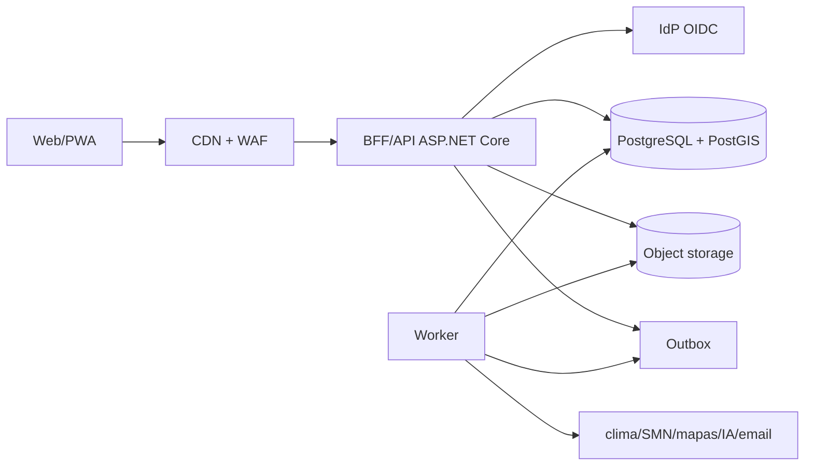

# Arquitectura propuesta

Estado: recomendación inicial, sujeta a spikes y decisiones del sponsor.

## Decisión principal

Monolito modular desplegable como una unidad, aplicación web/PWA separada, PostgreSQL/PostGIS, almacenamiento de objetos y worker. No microservicios ni Kubernetes al inicio. El objetivo es preservar transacciones fuertes y bajar complejidad mientras se mantienen límites internos separables.

## Stack de referencia

- Frontend: Next.js + React + TypeScript, web responsive/PWA online.
- Backend: ASP.NET Core sobre .NET 10 LTS.
- Base: PostgreSQL administrado + PostGIS.
- Archivos: object storage privado compatible con S3.
- Identidad: proveedor administrado OIDC intercambiable.
- Mapas: MapLibre, con tiles/geocodificación bajo interfaces sustituibles.
- Procesos: worker del mismo repositorio, outbox/inbox; broker solo si la carga lo exige.
- Contratos: REST/JSON + OpenAPI; GeoJSON/patrones OGC para GIS.
- Observabilidad: OpenTelemetry/OTLP.
- Entrega: contenedores OCI sobre plataforma administrada.

## Vista de contenedores



## Módulos

1. Identity/Tenancy
2. Establishments/GIS
3. National Catalog/Productive Core
4. Operations
5. Agriculture
6. Livestock
7. Inventory/Assets
8. Commerce/Finance
9. Weather/Agroclimate
10. Grazing/Forage Planning
11. Documents
12. Analytics/AI
13. Audit/Compliance
14. Integrations

`Fiscal/ARCA` queda reservado como módulo futuro y no se implementa en el MVP.

Cada módulo posee modelo, casos de uso y tablas. No consulta directamente tablas internas de otro módulo; usa contratos de aplicación o eventos internos.

`National Catalog/Productive Core` publica versiones inmutables de taxonomía y perfiles, y ofrece el contrato común `ManagementUnit → ProductionCycle → ProductionEvent/Output`. Agriculture, Livestock, Apiary/Aquaculture futuros y otros perfiles extienden ese contrato; no se fuerzan entre sí.

## Multi-tenancy

- Tenant: `Organization`; puede tener múltiples CUIT y establecimientos si el sponsor lo confirma.
- `tenant_id` obligatorio en tablas, índices, relaciones, cache, jobs, archivos y auditoría.
- Autorización por objeto en aplicación más PostgreSQL Row-Level Security `default deny`/`FORCE RLS`.
- Rol de aplicación sin propiedad de tablas ni `BYPASSRLS`.
- Contexto de tenant/usuario configurado con `SET LOCAL` dentro de transacción.
- Pruebas negativas automáticas en endpoints, jobs, exportes y URLs firmadas.

## GIS

- Geometrías como `MultiPolygon` con SRID explícito, validación topológica e índice GiST.
- Guardar coordenadas canónicas y calcular áreas/distancias con estrategia elipsoidal/proyección apropiada.
- Versionar límites y relaciones de subdivisión/fusión.
- MapLibre no incluye por sí mismo tiles comerciales: el proveedor se configura por entorno.
- No usar `tile.openstreetmap.org` para descarga offline o SLA productivo.
- Catálogos STAC para escenas satelitales cuando se incorpore teledetección.

## Conectividad del MVP

- El MVP requiere conexión para consultar y guardar.
- Sin conectividad, la interfaz informa claramente que no puede confirmar cambios y conserva únicamente estado visual no sensible de la sesión; no promete cola local ni sincronización posterior.
- Reintentos e idempotencia existen en servidor para proveedores externos y dobles clics, no como modo offline del dispositivo.
- Service worker, IndexedDB de negocio, descarga de mapas y resolución de conflictos quedan fuera del MVP.
- La arquitectura mantiene contratos versionados y eventos para poder incorporar offline en una fase futura si el piloto demuestra la necesidad.

## Datos y documentos

- PostgreSQL como fuente transaccional; no guardar binarios grandes en la base.
- Object storage privado con URL firmada breve, hash, antivirus, MIME allow-list y límites.
- Réplicas/warehouse analítico se incorporan solo por necesidad medible.
- Backups con point-in-time recovery y pruebas de restauración.

## Integraciones

Ports/adapters y capa anticorrupción por proveedor. Toda llamada externa incluye timeout, retry selectivo, circuit breaker, idempotencia, correlación y modo degradado. La caída del proveedor meteorológico o de IA no debe impedir usar los módulos transaccionales; el dato se marca `fresh`, `stale` o `unavailable`.

### Catálogo y territorio nacional

- Adaptador Georef para códigos oficiales; cache local versionada y fallback al último snapshot correcto.
- Pipelines separados para CNA/SENASA/INASE/INV/SAGyP; nunca escribir directamente en tablas publicadas.
- Flujo `source snapshot → staging → normalización → diff/revisión → publicación` con hash, changelog y rollback.
- Extensiones de tenant en una capa separada; schemas de atributos por perfil, no EAV ni JSON libre sin validar.
- Matriz de soporte consultable por la UI para impedir que `CATALOGADA` se presente como `ESPECIALIZADA_VALIDADA`.

### Meteorología

- `WeatherProvider` interno; nunca llamar al proveedor desde el navegador.
- Open-Meteo comercial como integración REST principal propuesta para el MVP.
- SMN CAP como fuente autoritativa de alertas oficiales.
- Ingesta backend de SMN WRF 4 km como fallback 0–72 h después del spike NetCDF/costos.
- Snapshots inmutables por modelo/corrida/horizonte para auditoría y evaluación.
- Pluviómetro/estación del campo separado del pronóstico y del reanálisis.

## Identidad

- OIDC Authorization Code + PKCE.
- Cookies de sesión `HttpOnly`, `Secure`, `SameSite`; no tokens en `localStorage`.
- Passkeys WebAuthn preferidas, Google federado, email OTP alternativo, TOTP como MFA y códigos de recuperación.
- Step-up para roles privilegiados, exportes y cambios de identidad; los controles de emisión fiscal quedan reservados para una etapa futura.

## Operación

- Logs estructurados sin payloads sensibles.
- Trazas, métricas y logs correlacionados; tenant seudonimizado.
- Readiness/liveness separados.
- Métricas: latencia, errores, conexiones, backlog, reintentos, frescura/cobertura meteorológica, CAP vigente, error por horizonte, recomendaciones aceptadas/rechazadas y datos faltantes.
- Runbooks para proveedor de clima/SMN/IdP/IA caídos, cola atascada y restauración.

## Estructura de repositorio sugerida

```text
AgropecuarIA/
  apps/
    web/
    api/
    worker/
  modules/
    identity/
    gis/
    operations/
    agriculture/
    livestock/
    inventory/
    finance/
    weather/
    grazing/
    documents/
    ai/
  contracts/
  deploy/
  docs/
  tests/
```

La estructura final debe seguir convenciones reales de .NET/Next.js y no crear paquetes vacíos antes de implementar cada slice.

## Criterios para separar un servicio

Solo separar cuando exista al menos una causa medible: escalado independiente sostenido, límites de seguridad/aislamiento, frecuencia de despliegue incompatible, ownership de equipo o resiliencia diferente. Candidatos futuros: procesamiento satelital, ingesta IoT o gateway de IA; no se separan preventivamente.

## ADR iniciales

- [ADR-001: monolito modular](adr/ADR-001-monolito-modular.md)
- [ADR-002: PostgreSQL/PostGIS y geometrías versionadas](adr/ADR-002-postgis.md)
- [ADR-003: identidad moderna](adr/ADR-003-identidad.md)
- [ADR-004: IA consultiva](adr/ADR-004-ia-control-humano.md)
- [ADR-005: meteorología multifuente](adr/ADR-005-meteorologia.md)
- [ADR-006: catálogo productivo nacional y perfiles](adr/ADR-006-catalogo-productivo-nacional.md)
- [ADR-007: storage privado, retención y recuperación](adr/ADR-007-storage-retencion-recuperacion.md)

Decisiones posteriores: offline/outbox, RLS, capa fiscal ARCA futura, proveedor/región productivos de object storage, OpenTelemetry y criterios de no-Kubernetes.
