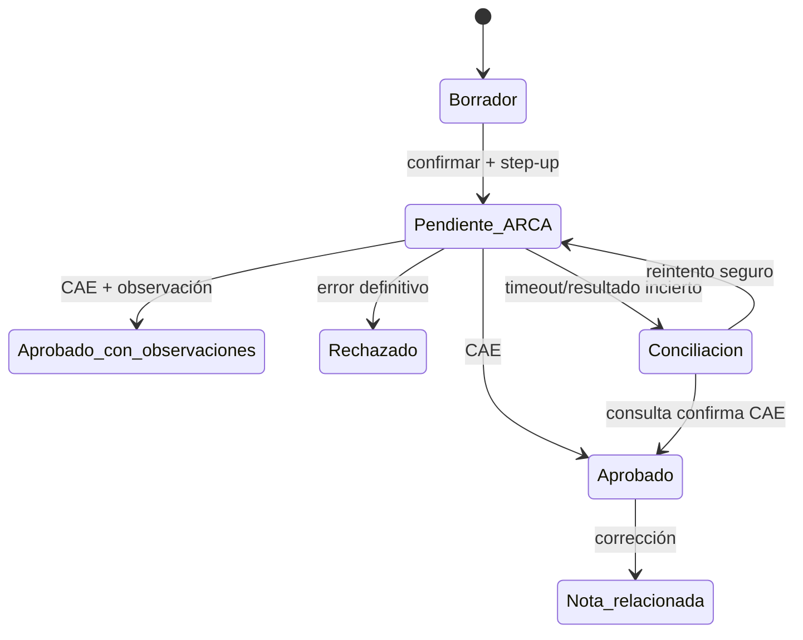

# Integraciones y normativa

Vigencia de la investigación: 2026-08-04. Todo requisito fiscal/sanitario debe revalidarse antes de producción.

## ARCA: contexto futuro, fuera del MVP

Decisión del sponsor: AgropecuarIA no emitirá comprobantes ni se integrará con ARCA en el MVP. Se conserva esta investigación para evitar rediseño futuro; ningún usuario verá acciones de CAE, punto de venta o emisión en la primera versión.

Los servicios públicos documentados permiten autorizar/consultar comprobantes emitidos, validar comprobantes recibidos, consultar constancias registrales y operar documentos sectoriales. No se encontró una API pública general para descargar automáticamente todas las compras, deudas, declaraciones, activos y saldos de un contribuyente. Por eso, balances, activos y costos son módulos propios alimentados por operaciones, documentos, bancos, inventario y valuaciones.

### Integración recomendada

- `WSAA`: certificado X.509, solicitud firmada y Ticket de Acceso por servicio; ARCA informa vigencia actual de 12 horas.
- `WSFEv1`: comprobantes generales sin detalle de ítems enviado a ARCA; los renglones comerciales se conservan localmente.
- `WSMTXCA`: evaluar si ARCA debe recibir detalle de ítems.
- `WSFEXv1`: exportaciones.
- `ws_sr_constancia_inscripcion`: constancia/padrón; reemplaza al antiguo A5 deprecado.
- `WSCDCV1`: constatación de comprobantes recibidos; no es una bandeja completa de compras.

### Delegación para SaaS

El cliente delega el servicio específico a la CUIT operadora mediante Administrador de Relaciones; el SaaS acepta y vincula su certificado. Nunca se solicita ni almacena la Clave Fiscal, que es personal e intransferible.

Onboarding fiscal:

1. Verificar perfil/CUIT y actividad con el contador.
2. Crear punto de venta Web Services específico.
3. Delegar servicio y aceptar relación.
4. Configurar certificado/clave en KMS o HSM.
5. Probar homologación y casos contables acordados.
6. Habilitar producción con checklist y aprobación.

### Flujo de emisión

Guardar CAE, vencimiento, ambiente, códigos, correlación, request/response protegidos, tipo, punto de venta y numeración. Consultar último autorizado/comprobante antes de reintentar ante incertidumbre. El PDF incluye QR conforme especificación oficial.

### Compras/gastos

MVP realista:

- carga manual y plantillas CSV/Excel;
- PDF/imagen/email con OCR;
- lectura QR;
- constatación con WSCDCV1;
- revisión humana y conciliación bancaria.

Portal IVA documenta experiencia interactiva e importaciones, pero no una API general pública de extracción SaaS.

### Documentos agropecuarios específicos

- Granos: Liquidación Primaria/Secundaria (`WSLPG`) y Carta de Porte Electrónica (`WSCPE`).
- Ganadería: Liquidación Sector Pecuario (`WSLSP`) y DT-e/SIGSA bajo SENASA.
- Lechería: Liquidación Mensual Única (`WSLUM`).
- Vegetales alcanzados: DTV-e/SIGDTV.
- Otros: remito cárnico y servicios sectoriales según actividad.

No deben modelarse como simples variantes de WSFE. Cada uno requiere roles, habilitaciones y factibilidad.

## SENASA y registros productivos

- RENSPA relaciona responsable/productor, actividad y predio; varios productores en un establecimiento pueden tener registros distintos.
- SIGSA registra existencias/movimientos animales y DT-e.
- Desde 2026, bovinos/bubalinos/cérvidos comerciales alcanzados requieren identificación electrónica individual al destete o antes del primer movimiento, según normativa vigente.
- DTV-e aplica a productos/materiales vegetales alcanzados y exige registros/servicios previos.
- Integrar RFID/importaciones antes de prometer escritura directa en SIGSA.

Principio: portal disponible no implica API. Sin mecanismo oficial, usar importación/exportación asistida y conciliación; no scraping.

## Catálogo productivo y territorio nacional

- **Georef Argentina**: fuente pública/oficial para normalizar provincia, departamento/partido/comuna, municipio, gobierno local, localidad y asentamiento. Conservar IDs oficiales y snapshot usado.
- **INDEC CNA 2018**: línea base estadística nacional para familias vegetales, existencias/especies y unidades productivas; es una foto censal, no un catálogo vivo.
- **SENASA Cadena Vegetal/Animal y RENSPA**: estructura sanitaria/productiva y futuros perfiles regulatorios; no reutilizar sus categorías con otro significado.
- **INASE RNC**: referencia autoritativa de cultivares habilitados para comercialización; sincronizar/versionar si existe mecanismo estable, sin copiar una lista permanente.
- **INV**: fuente especializada para vid, variedades y aptitud.
- **SAGyP/INTA**: relevancia, campañas, regiones, sistemas y conocimiento técnico; ausencia en una serie no prueba que una producción no exista.

No existe una única fuente oficial, viva y exhaustiva de todas las producciones. `Catálogo Nacional v1` combinará fuentes declaradas, preservará procedencia y publicará excepciones. Las reglas provinciales solo se automatizan con fuente, vigencia y validación profesional.

## Meteorología: integración central del MVP

### Estrategia propuesta

- **Open-Meteo comercial**: proveedor REST/JSON principal. Usar ECMWF IFS como modelo principal y GFS como comparación/extensión, sujeto a plan contratado.
- **SMN CAP**: fuente autoritativa de alertas oficiales argentinas; procesar emisión, actualización, cancelación, vencimiento y polígonos.
- **SMN WRF**: fallback regional oficial de 4 km y 72 horas, mediante pipeline backend NetCDF; incorporarlo después de medir costo de ingesta.
- **Pluviómetro/estación del campo**: fuente prioritaria de lluvia observada local.
- **NASA POWER/IMERG, INA e INTA**: contexto histórico/complementario, nunca sustituto silencioso de medición local.

Precedencia descriptiva de lluvia observada:

`pluviómetro del campo → estación cercana con distancia → satélite/INA → análisis de modelo → pronóstico`

El primer elemento es opcional: cuando no existe, la cadena comienza en la mejor fuente disponible y la UI indica que no hay calibración local.

Datos mínimos guardados: proveedor, modelo, corrida, `issued_at`, `valid_at`, tipo `observed|estimated|forecast`, punto/celda, resolución, unidad, fecha de ingesta, payload/hash y estado `fresh|stale|unavailable`.

Reglas:

- No confundir probabilidad de precipitación con milímetros.
- Un dato de modelo/reanálisis no se rotula “medido”.
- Alertas de color oficiales provienen del SMN, no de inferencias propias.
- Para campos grandes consultar puntos representativos; no inventar variación entre lotes menores que la celda del modelo.
- Mostrar fuente, actualización y atribución visible.
- Si clima falla, las operaciones siguen; nuevas recomendaciones sensibles se abstienen o usan dato obsoleto explícito según política.

## Mapas y geodatos

- Cliente cartográfico: MapLibre.
- Persistencia/consultas: PostgreSQL/PostGIS.
- Capas oficiales candidatas: IGN/Argenmap y geoservicios WMS/WFS/WMTS, sujetos a disponibilidad/términos.
- Georef normaliza unidades territoriales y resuelve ubicación administrativa para cualquier coordenada del país; no reemplaza parcela catastral ni polígono productivo.
- OpenStreetMap exige atribución; sus tiles públicos no ofrecen SLA y prohíben descarga masiva/offline.
- Satélite: adoptar STAC; evaluar Copernicus/INTA/proveedor comercial según resolución, nubosidad, latencia y licencia.
- Clima: proveedor local a validar; NASA POWER sirve como fuente complementaria de series agroclimáticas, no como observación exacta de un lote.

## Protección de datos argentina

La Ley 25.326 exige finalidad, calidad, información, seguridad, confidencialidad y derechos de titulares. La AAIP mantiene el Registro Nacional de Bases de Datos Personales; la inscripción del responsable precede al registro de bases. Antes de producción se debe definir responsable/encargado, registrar lo aplicable y revisar transferencias internacionales de hosting/IA.

Datos de ubicación, productividad, inventario, patrimonio y hacienda se clasifican además como confidenciales de negocio aunque no todos sean datos personales sensibles.

## Matriz de factibilidad

| Integración | Valor | Disponibilidad pública | Fase propuesta | Validación |
|---|---|---:|---|---|
| Google OIDC | Login | Sí | MVP | Configuración/privacidad |
| Passkeys WebAuthn | Login fuerte | Estándar | MVP | Compatibilidad/recovery |
| Tiles/geocoding | Mapa | Según proveedor | MVP | Licencia, costo, cobertura |
| Georef Argentina | Territorio oficial | API/descarga pública | MVP | Versionado, códigos y fallback |
| CNA/SENASA/INASE/INV/SAGyP | Catálogo productivo | Fuentes heterogéneas | MVP por snapshots | Gobierno, licencia, vigencia y diffs |
| IGN/Argenmap | Capas oficiales | Servicios publicados | Should | SLA/términos |
| Open-Meteo comercial | Pronóstico operativo | REST + API key | MVP | Plan, atribución y evaluación regional |
| SMN CAP | Alertas oficiales | Feed CAP público | MVP | Parser, polígonos, frescura |
| SMN WRF | Fallback 0–72 h | S3/NetCDF | MVP tras spike | Ingesta, almacenamiento y validación |
| Pluviómetro/estación | Lluvia observada opcional | Manual/IoT | Capacidad MVP | Calidad, timestamp y ubicación |
| ARCA WSAA/WSFEv1 | Emisión | Sí, autorizada | Fuera del MVP | Decisión futura + contador |
| ARCA padrón/constatación | Validación | Según alcance | Fuera del MVP | Acceso productivo futuro |
| SENASA/SIGSA | Trazabilidad animal | Portal; API a confirmar | Posterior | Convenio/mecanismo |
| RFID | Captura animal | Dispositivo/archivo | Should | Modelos/formatos |
| DTV-e/SISA/CPE | Agro regulatorio | Caso específico | Posterior | Segmento/credenciales |
| NASA POWER/INA/INTA | Histórico/observado complementario | Variable | Should | Cobertura/licencia/calidad |
| Satélite/NDVI | Monitoreo | Sí según fuente | Should | Resolución/licencia |
| Bancos/ERP | Conciliación | Variable | Posterior | Bancos/estudio |
| IA | Asistencia | Sí | MVP acotado | Contrato, costo, evals |

## Validaciones profesionales obligatorias

- Clases/alícuotas IVA, retenciones/percepciones, Factura de Crédito MiPyME e Ingresos Brutos.
- Canjes, consignación, intermediación, liquidaciones y fechas fiscales.
- Valuación de hacienda, granos, producción en proceso, activos y amortizaciones.
- Conservación documental y exportes al estudio.
- Receta agronómica/veterinaria por provincia y profesional.
- Contrato de delegación fiscal, responsabilidad y privacidad.
