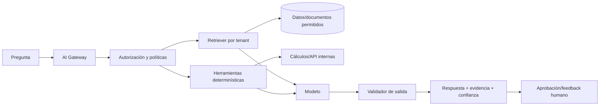

# Estrategia de inteligencia artificial

## Objetivo

Usar IA para ayudar al ingeniero agrónomo/productor a interpretar clima y planificar rotaciones sobre datos confiables. La IA no es la fuente de verdad y no reemplaza al profesional ni al productor.

La presencia de una actividad en el catálogo nacional no habilita automáticamente recomendaciones. Un caso de IA solo opera con `ActivityProfileVersion`, jurisdicción, dataset y responsable profesional aprobados; fuera de ese alcance se limita a resumir datos comunes y señalar capacidades no disponibles.

## Casos priorizados

### MVP

1. Resumen meteorológico por campo/lote: lluvia probable/esperada, temperatura, humedad, viento, alertas oficiales, fuente, corrida y frescura.
2. Ventanas de decisión para labores, expresadas como riesgos/alternativas y nunca como certeza.
3. Balance forrajero y recomendación de próximo potrero, días máximos de ocupación, descanso/revisión y faltantes de medición.
4. Preguntas y resúmenes sobre datos/documentos autorizados.
5. Explicación de KPI y diferencias plan vs. real.
6. Alertas narradas de vencimientos, faltantes, tareas y datos inconsistentes.

### Posteriores a datos suficientes

- Anomalías de rendimiento/NDVI y priorización de recorridas.
- Proyección de caja y escenarios de precio/rendimiento.
- Predicción de rendimiento, enfermedades o mantenimiento con modelos validados.
- Optimización de planes bajo restricciones, siempre con aprobación.

## Casos prohibidos sin humano

- Emitir o anular comprobantes y pagos.
- Elegir tratamiento fiscal/contable.
- Ordenar aplicaciones, dosis, tratamientos veterinarios o movimientos animales.
- Modificar stock, asientos, geometrías o registros oficiales.
- Inventar lluvia, biomasa, tasa de crecimiento, consumo o calidad nutricional.
- Aplicar reglas, parámetros o modelos de una especie/cultivo a otra entrada del catálogo.
- Convertir un déficit de materia seca directamente en una ración/suplemento sin profesional.
- Negar acceso/crédito o tomar decisiones legales automáticamente.

## Arquitectura

- Gateway con proveedores/modelos intercambiables por tarea.
- RAG con filtros de tenant/recurso aplicados antes y después de recuperar.
- Herramientas allow-list; sin SQL libre, navegador libre ni acciones críticas.
- Funciones determinísticas para hectáreas, márgenes, stock, carga y conversiones.
- Motor determinístico de pastoreo para oferta utilizable, demanda diaria, remoción, días máximos, déficit y próxima revisión.
- Salida estructurada con fuentes, período, supuestos, confianza y faltantes.
- Costos, tokens, latencia y cuota por tenant.

## Contrato de recomendación

Toda recomendación contiene:

- identificador y fecha;
- pregunta/objetivo;
- alcance de organización, campo/lote/rodeo y período;
- evidencia citada y fecha de actualización;
- observaciones vs. inferencias;
- supuestos y datos faltantes;
- recomendación y alternativas;
- nivel de confianza y motivo;
- modelo/proveedor/versión de prompt;
- proveedor/modelo/corrida meteorológica y tipo observado/estimado/pronosticado;
- versión del perfil forrajero, mediciones y fórmulas utilizadas;
- actividad, taxón/cultivo, sistema, perfil especializado y nivel de soporte usados;
- decisión humana, comentario y resultado posterior.

## Separación de responsabilidades

- El proveedor meteorológico entrega números estructurados; el LLM no los recalcula ni completa.
- El motor de pastoreo aplica fórmulas versionadas y reglas profesionales.
- La IA explica por qué un potrero es candidato, compara alternativas y enumera datos faltantes.
- El productor confirma/modifica/rechaza; aceptar una sugerencia no crea el movimiento real.
- Sin biomasa/altura puede mostrar escenarios bajo/base/alto de un perfil validado, identificados como estimaciones, pero se abstiene de declarar capacidad, fecha exacta o potrero listo. Sin agua, restricciones válidas, cantidad/peso, consumo o clima requerido, se abstiene de recomendar ingreso.

## Seguridad y privacidad

- No enviar claves, tokens, certificados ni payloads fiscales completos.
- Minimizar CUIT, identidades y coordenadas cuando no sean necesarias.
- Contrato de proveedor: no entrenamiento con datos del cliente por defecto, retención limitada y subprocesadores conocidos.
- Documentos externos se tratan como datos no confiables; instrucciones embebidas no se ejecutan.
- Respuestas meteorológicas externas también se validan como datos no confiables: esquema, rango, unidad y timestamp.
- Aislar conversaciones y caches por tenant.
- Herramientas vuelven a autorizar cada recurso; el modelo nunca otorga permisos.
- Red-team de prompt injection, exfiltración, tool abuse y datos cruzados.

## Calidad y evaluaciones

Crear dataset versionado con casos validados por agrónomo, veterinario y contador:

- respuesta correcta y evidencia esperada;
- rechazo apropiado cuando faltan datos;
- cálculo determinístico exacto;
- no fuga entre tenants;
- resistencia a instrucciones maliciosas;
- identificación de incertidumbre;
- estabilidad de formato/latencia/costo.
- no contaminación de parámetros entre perfiles, especies, cultivos o jurisdicciones.

Métricas por caso: groundedness/cita válida, exactitud, tasa de abstención correcta, falsos positivos/negativos, aceptación humana, correcciones, costo y latencia. Un promedio global no debe ocultar errores de alto riesgo.

## Ciclo de vida

1. Definir decisión y riesgo.
2. Obtener línea base sin IA.
3. Curar ejemplos y criterios con especialista.
4. Implementar en sombra/read-only.
5. Evaluar con dataset histórico y piloto limitado.
6. Mostrar recomendación con aprobación.
7. Medir resultado y drift.
8. Revertir modelo/prompt si se supera umbral.

## Gobernanza

- Owner por caso de uso y registro de riesgos.
- Versionado y changelog de modelos/prompts/datasets.
- Aprobación previa a modelos nuevos en funciones sensibles.
- Feature flags y kill switch por tenant/caso.
- Canal para reportar respuestas incorrectas.
- Revisión periódica de sesgos, proveedores, costos y seguridad.
- NIST AI RMF como marco de referencia; adaptación al contexto argentino y rural.
