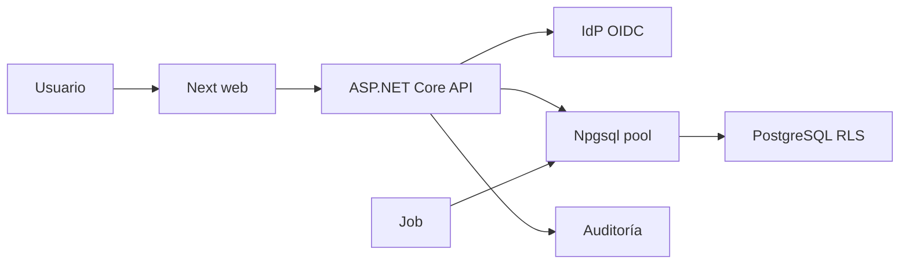

# Threat model — AGRO-DIS-003

## Executive summary

Los riesgos dominantes son toma de cuenta durante linking/recovery y fuga cross-tenant por contexto falsificado o residual en API, pool y jobs. El spike reduce estos riesgos mediante identidad externa `(issuer, subject)`, reautenticación de ambas cuentas, sesión opaca, autorización server-side y PostgreSQL `FORCE RLS`; no valida todavía un IdP real ni una topología productiva.

## Scope and assumptions

- In scope: `tasks/evidence/AGRO-DIS-003/contracts/**` y `spike/**`.
- Runtime modelado: navegador → prototipo Next → API Minimal .NET → proveedor OIDC conceptual; API/job → Npgsql → PostgreSQL efímero.
- Datos: dos organizaciones y usuarios totalmente sintéticos; no CUIT, email real, coordenadas ni secretos.
- Internet exposure: hipotética para producción; el spike local escucha solo loopback.
- Authentication: el fixture local no es autenticación; únicamente permite probar contratos después de un resultado OIDC supuesto.
- Out of scope: IdP/credenciales reales, deploy, CI, soporte JIT, ARCA, autorización productiva y decisión legal de propiedad de datos.
- El sponsor delegó defaults técnicos y pidió no pausar por nuevas preguntas. Las conclusiones condicionales que cambiarían con escala, contrato, región o IdP se mantienen explícitas.

Preguntas abiertas que alteran el riesgo productivo: plan/región/DPA del IdP, contrato propietario-productor-asesor, SLA/retención, relación Organization↔CUIT y topología de hosting.

## System model

### Primary components

- Next.js: demuestra journeys y estados; no almacena tokens ni llama al proveedor.
- ASP.NET Core: borde conceptual para sesión, linking, recovery, autorización y contexto tenant.
- IdP administrado: autentica y conserva passkeys/TOTP/recovery; no decide tenant ni permisos.
- PostgreSQL: usuarios globales, membresías, datos tenant y auditoría; RLS es defensa adicional.
- Jobs: consumidores conceptuales con tenant/actor/correlación explícitos y reautorización.
- Tooling: scripts de clúster efímero con SCRAM/credenciales rotadas y fixtures, separados de runtime productivo.

### Data flows and trust boundaries

- Navegador → Next/API: cookies y comandos HTTPS; CSRF, límites, validación de schema y autorización por recurso requeridos.
- API → IdP: OIDC Authorization Code + PKCE; validar `state`, `nonce`, firma, `iss`, `aud`, `azp`, `exp`, `auth_time`, `acr` y `amr`.
- IdP → callback API: código/claims no confiables hasta validación completa; tokens permanecen server-side.
- API → pool/DB discovery: el actor se deriva de la sesión y se fija con `set_config(..., true)` dentro de una transacción; el rol read-only solo ve memberships activas propias.
- API → pool/DB tenant: después de seleccionar organización, SQL parametrizado y contexto tenant transaccional antes del primer acceso.
- Job → DB: contexto firmado/interno, reautorizado al ejecutar; tenant ausente falla antes del SQL.
- API → auditoría: IDs/códigos de resultado/correlación; nunca tokens, OTP, recovery codes o email.

#### Diagram

## Assets and security objectives

| Asset | Why it matters | Security objective (C/I/A) |
|---|---|---|
| Identidad `(issuer, subject)` | Vincula persona externa con usuario interno | C/I |
| Sesión y security version | Una copia o revocación tardía permite ATO | C/I/A |
| Membresías y permisos | Determinan acceso por organización/recurso/estado | I/A |
| Tenant efectivo | Un error produce fuga masiva entre empresas | C/I |
| Datos productivos tenant | Incluyen ubicación, stock y productividad futura | C/I/A |
| Recovery/link challenges | Replay o enumeración habilitan toma de cuenta | C/I |
| Auditoría | Permite atribución, investigación y rectificación | I/A |
| Configuración/credenciales IdP/DB | Su exposición compromete todas las cuentas | C/I |

## Attacker model

### Capabilities

- Usuario remoto no autenticado capaz de automatizar login/recovery y manipular callbacks/requests.
- Miembro legítimo de una organización que conoce o adivina IDs de otra.
- Usuario multi-organización que intenta conservar contexto viejo o forjar tenant.
- Atacante con sesión robada, identidad externa secundaria o control temporal del navegador.
- Payload externo/IdP inesperado y ejecución concurrente/reintentos.

### Non-capabilities

- No se presume acceso administrativo al host, superusuario PostgreSQL, claves de firma del IdP ni modificación del código desplegado.
- El fixture local no está expuesto en producción; si lo estuviera, sería una vulnerabilidad crítica y no una capacidad normal.

## Entry points and attack surfaces

| Surface | How reached | Trust boundary | Notes | Evidence |
|---|---|---|---|---|
| Callback/login conceptual | Internet/OIDC | IdP → API | `state`/nonce/PKCE/claims | `docs/adr/ADR-003-identidad.md` |
| Session/switch/revoke | Cookie-auth HTTP | Browser → API | tenant cliente no autoritativo | `contracts/effective-context.schema.json` |
| Resolución interna de memberships | Session endpoint → port DB | API → pool de discovery | actor server-side; resultado conceptual 0/1/N antes del tenant | `contracts/membership-discovery.schema.json` |
| Link attempts | Cookie-auth HTTP | Browser/IdP → API | ambas identidades reautenticadas | `contracts/link-attempt.schema.json` |
| Recovery start/complete | Internet/IdP | Browser → API | anti-enumeración/rate limit | `docs/07-seguridad-y-privacidad.md` |
| Resource lookup | HTTP ID | Browser → API/DB | permiso server-side, BOLA neutral + RLS | `spike/api/Data/TenantRecordEndpoints.cs` |
| Pool/job context | Internal call | API/job → DB | transacción + `SET LOCAL` | `spike/database/probes/002_rls_isolation.sql` |
| Fixture endpoints | Loopback Spike only | Test tooling → API | deben desaparecer fuera de Spike | `spike/api/Program.cs` |

## Top abuse paths

1. Atacante registra el email de una víctima en otro IdP → sistema auto-linkea por email → toma su cuenta.
2. Miembro A envía organization/record ID de B → API confía el tenant cliente o no revalida la membership vigente → consulta datos de B.
3. Request A devuelve conexión al pool con setting de sesión → request B/sin tenant reutiliza conexión → observa A.
4. Job se ejecuta sin tenant o con membresía revocada → consulta global accidental → fuga o mutación cross-tenant.
5. Atacante repite callback/link challenge → vincula una secundaria después de expiración o a otro usuario.
6. Recovery revela si existe email y no limita intentos → enumeración/OTP bombing → takeover o DoS dirigido.
7. Sesión robada sigue válida después de recovery/revocación → atacante conserva acceso.
8. Fixture auth queda habilitado fuera del ambiente Spike → bypass completo de autenticación.

## Threat model table

| Threat ID | Threat source | Prerequisites | Threat action | Impact | Impacted assets | Existing controls (evidence) | Gaps | Recommended mitigations | Detection ideas | Likelihood | Impact severity | Priority |
|---|---|---|---|---|---|---|---|---|---|---|---|---|
| TM-001 | Remoto con identidad secundaria | Email coincidente | Fuerza auto-link | Toma de cuenta | identidad, sesión, datos | `(iss,sub)` y doble reauth en contratos | IdP real no probado | Desactivar auto-link; TTL/one-shot/conflict | eventos de linking/replay | medium | high | critical |
| TM-002 | Miembro tenant | ID o tenant ajeno | BOLA/claim falsificado | Fuga cross-tenant | tenant, datos | discovery deriva actor de sesión, revalida membership y usa RLS; locator ajeno es neutral | matriz CRUD productiva pendiente | authz objeto/acción/estado; 404 neutral | AccessDenied correlacionado | high | high | critical |
| TM-003 | Concurrencia/pool | setting persiste | Reutiliza contexto A | Fuga silenciosa | tenant, datos | transacción + `set_config local`; pool size 1 probado tras commit/rollback/excepción/cancelación | stress productivo y timeout abrupto pendientes | repetir stress, timeout y cancelación con pool real | mismatch tenant/correlación | medium | high | critical |
| TM-004 | Job/reintento | contexto ausente/stale | Ejecuta como tenant incorrecto | Fuga/mutación | datos, auditoría | contexto explícito conceptual | worker productivo no existe | fail before SQL; reautorizar al ejecutar | job denied/no tenant metrics | medium | high | high |
| TM-005 | Remoto | callback/challenge capturado | Replay/mix-up | Linking o login indebido | sesión, identidad | state/nonce/PKCE requeridos | proveedor no probado | verificar issuer/aud/azp/auth_time; one-shot | nonce/replay failures | medium | high | high |
| TM-006 | Remoto | recovery accesible | Enumera/abusa/reutiliza | ATO/DoS | identidad, sesión | 202 uniforme, TTL, revocación | canal IdP real pendiente | límites por cuenta/IP; hash; notificación | recovery rate/denials | high | medium | high |
| TM-007 | Sitio malicioso | sesión cookie activa | CSRF de switch/link/revoke | Cambio de contexto/ATO | sesión, identidad | SameSite Lax y token antiforgery en mutaciones del spike | validación Origin productiva pendiente | conservar antiforgery, validar Origin y step-up | origin/CSRF failures | medium | high | high |
| TM-008 | Sesión robada | revocación tardía | Reutiliza cookie | Acceso persistente | sesión, datos | security version/revoke contract | store productivo pendiente | rotación, revocación server-side, expiración corta | use-after-revoke | medium | high | high |
| TM-009 | Operador/config | ambiente o principal DB mal configurado | Habilita fixture auth o discovery owner | Auth bypass/RLS bypass | todos | fixture condicionado a Spike; discovery valida principal exacto antes de servir; SCRAM sin trust | deployment no existe | fail startup outside Spike; compile/exclude fixture; roles por ambiente | startup security event | low | high | high |
| TM-010 | Payload/usuario | alto volumen | Agota auth/recovery | Indisponibilidad | API, IdP | límites requeridos | umbrales reales pendientes | rate limit/circuit breaker/degradación | 429, latency, provider-down | medium | medium | medium |

## Criticality calibration

- Critical: toma de cuenta o lectura/escritura cross-tenant reproducible; fixture bypass expuesto.
- High: replay, CSRF o revocación tardía que exige condiciones acotadas pero compromete cuenta/tenant; job con tenant incorrecto.
- Medium: DoS dirigido, enumeración parcial sin takeover o telemetría insuficiente.
- Low: información técnica no sensible o abuso ruidoso fácilmente limitado sin impacto tenant.

## Focus paths for security review

| Path | Why it matters | Related Threat IDs |
|---|---|---|
| `contracts/effective-context.schema.json` | Define estados/tenant/permisos que cruzan UI/API | TM-002, TM-008 |
| `contracts/membership-discovery.schema.json` | Acota el resultado actor-scoped previo a seleccionar tenant | TM-002, TM-003 |
| `contracts/link-attempt.schema.json` | Invariantes de linking/TTL | TM-001, TM-005 |
| `spike/api/Linking`, `Recovery` y `Sessions` | Linking, recovery, step-up y sesiones | TM-001, TM-005–TM-009 |
| `spike/api/Sessions` y `Data` | Derivación tenant, permiso y autorización | TM-002–TM-004 |
| `spike/api/Data` | Aplicación transaccional del contexto | TM-002–TM-004 |
| `spike/database/migrations/002_identity_model_and_rls.sql` | Owner, FORCE RLS y policies | TM-002–TM-004 |
| `spike/database/probes/002_rls_isolation.sql` | Prueba de A/B/sin contexto | TM-002–TM-004 |
| `spike/database/migrations/003_membership_discovery.sql` | Rol/grants/policies separados para discovery | TM-002, TM-003 |
| `spike/database/probes/003_membership_discovery.sql` | Prueba 0/1/N, columnas mínimas y accesos prohibidos | TM-002, TM-003 |
| `spike/web/features/identity` | Estados de conflicto/degradación sin secretos | TM-001, TM-006–TM-008 |
| `spike/scripts` | `trust` efímero y cleanup restringido | TM-009 |

## Notes on use

- Cada entrada y frontera descubierta está representada en los abusos/tabla.
- Runtime, tooling local y componentes futuros están separados.
- Los defaults delegados y las preguntas externas permanecen explícitos.
- El spike prueba controles propios y RLS, no la implementación real del IdP ni una postura productiva completa.
