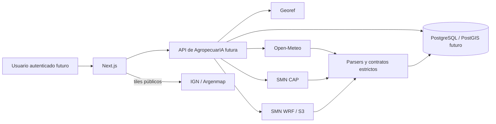

# Threat model — AGRO-DIS-004 GIS y meteorología

Fecha: 2026-08-05. Alcance: spike R0 local y descartable. Este análisis no autoriza una exposición productiva.

## Resumen ejecutivo

Los activos más sensibles de la futura capacidad son las coordenadas de lotes/potreros, la pertenencia tenant y la integridad/frescura de pronósticos y alertas. En este spike solo se usan centroides públicos, geometrías sintéticas y fuentes públicas; no existen identidad, persistencia multi-tenant ni secretos. Los riesgos dominantes son el agotamiento de recursos mediante geometrías/NetCDF/XML, la alteración o repetición de alertas, el schema drift meteorológico y la dependencia de recursos remotos del mapa. Los controles implementados fallan cerrados, pero autenticidad criptográfica de CAP, autorización por recurso y operación productiva siguen siendo gates de R2/R3.

## Alcance y supuestos

- El spike corre localmente, no está desplegado y no expone endpoints públicos.
- Las URLs de Georef, IGN, Open-Meteo, SMN CAP y SMN WRF son fijas y controladas por código; ninguna URL proviene del usuario.
- El navegador solo solicita tiles públicos de Argenmap. Clima, CAP y WRF se procesan del lado servidor.
- Los fixtures no contienen campos, productores ni datos personales reales.
- En producción, cada geometría y snapshot será tenant-scoped, con autorización por recurso, RLS defensiva y auditoría append-only.

## Modelo del sistema

Componentes locales relevantes: contratos JSON en `contracts/`; parsers y telemetría en `spike/src/`; validación espacial en `spike/postgis/`; lector NetCDF aislado en `scripts/inspect-wrf.py`; prototipo visual en `spike/web/`.

## Activos

| Activo | Sensibilidad futura | Objetivo |
|---|---|---|
| Coordenadas y geometrías productivas | Alta: ubicación y productividad | Confidencialidad, integridad y aislamiento tenant |
| Alertas CAP y lifecycle | Alta: seguridad operativa | Autenticidad, orden, vigencia y trazabilidad |
| Snapshots meteorológicos | Media/alta: recomendaciones | Procedencia, unidad, naturaleza, frescura e inmutabilidad |
| Credenciales/cuotas de proveedor | Alta | Solo backend, sin logs ni navegador |
| Disponibilidad de mapa/clima | Media | Degradación explícita sin fabricar datos |
| Evidencia y hashes del spike | Media | Reproducibilidad y supply-chain verificable |

## Modelo del atacante

Se consideran un usuario autenticado intentando acceder a recursos de otro tenant, un cliente anónimo abusando payloads, un proveedor o intermediario comprometido que entrega contenido malicioso/obsoleto, y una dependencia o fixture alterado. No se asume acceso administrativo al host ni compromiso total de PostgreSQL.

## Superficies de entrada

| Superficie | Entrada no confiable | Control presente | Gate productivo pendiente |
|---|---|---|---|
| CAP XML (`CapParser.cs`) | XML, referencias, polígonos y fechas | 2 MiB, DTD/entidades prohibidas, schema/lifecycle/sender estrictos | firma/canal autenticado, replay store durable y monitoreo de frescura |
| Open-Meteo (`OpenMeteoParser.cs`) | JSON, unidades, tiempos y HTTP status | 4 MiB, unidades/schema estrictos, errores tipados, null nunca es cero | allow-list de modelos, cuota, retry/circuit breaker y contrato comercial |
| WRF (`inspect-wrf.py`, `WrfMetadataValidator.cs`) | NetCDF y metadata nativa | SHA-256 fijado, 25 MiB, ≤2 M celdas, variables/formato y memoria/tiempo medidos | sandbox de proceso, scan de librería nativa y presupuesto operacional |
| Geometría (`test-spatial-contract.sql`) | GeoJSON/WKB y vértices | SRID 4326, tipos, validez, tamaño/vértices, sin reparación silenciosa | autorización tenant, límites en API y timeout de query |
| Tiles (`next.config.ts`, `territory-map.tsx`) | imágenes/scripts remotos | CSP allow-list, atribución y tabla fallback | proxy/cache opcional, SLA y política de privacidad |
| Probes PowerShell | respuestas y disponibilidad de red | URLs constantes, timeouts, resultados sin secretos | ejecución en runner aislado y egress allow-list |

## Caminos de abuso prioritarios

1. Un payload geométrico o NetCDF consume CPU/memoria antes de validar dimensiones. Mitigación: límites previos al parser, budgets medidos y rechazo fail-closed. En producción se agrega aislamiento de proceso y timeout de consulta.
2. Una alerta falsa, repetida o fuera de orden permanece activa. Mitigación: identidad `sender+identifier+sent`, referencias, mismo sender, historial append-only, expiración/cancelación. Falta autenticar el canal/firma y persistir idempotencia.
3. Schema drift o unidad inesperada convierte un valor incorrecto en una recomendación. Mitigación: contratos y unidades exactas, error tipado, `unavailable/stale`, procedencia y naturaleza explícitas; nunca imputar cero.
4. Un usuario obtiene geometrías de otro tenant por ID predecible. No existe esa superficie en R0. R2 debe derivar tenant de sesión, aplicar autorización por objeto y RLS, y responder de modo neutral.
5. Un proveedor de tiles rastrea o degrada al usuario. El prototipo comparte únicamente viewport/tiles públicos y conserva tabla local. Producción debe decidir proxy/cache, términos y minimización antes de enviar coordenadas privadas.

## Registro de amenazas

| ID | Amenaza | Impacto | Probabilidad | Control/gate | Estado |
|---|---|---:|---:|---|---|
| TM-001 | BOLA sobre geometría tenant | Alto | Alta en una API sin control | Authz por recurso + tenant derivado + RLS | Pendiente R2, bloquea producción |
| TM-002 | Geometry/NetCDF/XML resource exhaustion | Alto | Media | Límites, hashes, DTD off, budgets y tests negativos | Mitigado en spike; sandbox pendiente |
| TM-003 | CAP spoof/replay/out-of-order | Alto | Media | Identidad, sender, referencias, expiry, append-only | Parcial; autenticidad durable pendiente |
| TM-004 | Schema/unit drift meteorológico | Alto | Media | Parsers estrictos, errors y stale/unavailable | Mitigado contractualmente |
| TM-005 | Exposición de coordenadas a terceros/logs | Alto | Media | Fixtures públicos; clima solo backend | Privacidad/retención/proxy pendientes |
| TM-006 | SSRF por proveedor configurable | Alto | Baja en spike | URLs constantes, sin URL de usuario | Mantener allow-list productiva |
| TM-007 | Compromiso supply-chain nativa GIS/NetCDF | Alto | Baja/media | pnpm/PostGIS tienen integridad fijada; Python fija versiones y .NET fija versiones pero aún sin hashes de artefacto | Parcial; lock/hashes y scan continuo pendientes antes de producción |
| TM-008 | Tiles caídos o manipulados | Medio | Media | CSP, atribución, tabla fallback | SLA/cache pendiente |
| TM-009 | Telemetría filtra ubicación/PII | Alto | Media | métricas actuales solo por proveedor/resultado | Redacción y revisión productiva pendiente |

## Calibración y foco de revisión

`TM-001`, `TM-003` y `TM-005` bloquean cualquier promoción productiva aunque el spike esté verde. La revisión de R2 deberá concentrarse en el boundary HTTP, resolución de tenant, política RLS, persistencia append-only CAP, configuración de egress y redacción de telemetría. No se identificó un hallazgo alto/crítico introducido y explotable en el spike local bajo los supuestos declarados.
