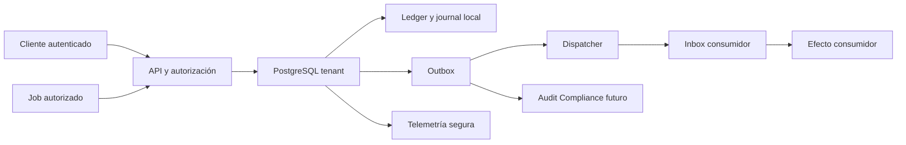

# Política de auditoría, retención operativa y amenazas de AGRO-FND-002

**Estado:** decisión de diseño R1; no es evidencia de runtime ni autorización productiva.
**Alcance:** protocolo discriminado `platform | tenant`; `CreateOrganization` es el bootstrap platform futuro y las mutaciones posteriores operan dentro de un tenant.
**Fuera de alcance:** broker, garantía exactly-once global, modo offline, plazos legales, legal hold productivo, WORM y promoción de los spikes R0.

## Evidencia y límites actuales

- [`AGRO-FND-002`](../../backlog/EPIC-01-fundacion-arquitectura.md#agro-fnd-002) exige autorizar antes de buscar o reproducir, una única transacción para negocio y outbox, y pruebas de concurrencia, crash, replay, RLS y tenant negativo. Su Definition of Done exige un slice real, no infraestructura aislada.
- [`AGRO-FND-001`](../AGRO-FND-001/contract-policy.md) fija scope explícito, errores neutrales, envelope versionado, duplicados idempotentes y cuarentena observable para versiones repetidas, gaps o majors desconocidos. El journal técnico de un módulo no sustituye Audit/Compliance.
- Identity demuestra atomicidad local de una mutación platform-scoped con journal y outbox, pero no posee ledger genérico, inbox, dispatcher ni RLS tenant productiva ([`IdentityApplicationService`](../../../src/AgropecuarIA.Identity/Application/IdentityApplicationService.cs); [`IdentityDbContext`](../../../src/AgropecuarIA.Identity/Infrastructure/IdentityDbContext.cs)).
- `AGRO-DIS-003` demuestra mecánica RLS/pool/job solo en un spike descartable. Su código, roles, credenciales y migraciones no se incorporan al runtime ([decisión de discovery](../AGRO-DIS-003/membership-discovery-decision.md)).
- `Q-020` aporta un envelope sintético de capacidad, mientras `Q-060`, `GAP-003` y `VAL-LEG` mantienen abiertos retención legal, soporte, región y operación productiva ([decisiones y gaps](../../decisions-and-gaps.md)).

Supuestos que condicionan esta política:

- el servidor deriva scope, actor y autorización; deriva tenant cuando el scope es `tenant`, y usa un namespace platform constante para bootstrap; ningún identificador del request es autoridad;
- PostgreSQL es la frontera transaccional y la entrega de outbox es al menos una vez;
- `AGRO-ID-003/CreateOrganization` está nominado como primer consumidor futuro y es un bootstrap `platform`, no una mutación tenant; todavía no existe en runtime ni autoriza absorber su implementación dentro de este artefacto ([backlog ID-003](../../backlog/EPIC-02-identidad-tenancy-autorizacion.md#agro-id-003));
- los plazos configurables aquí son operativos y no responden obligaciones legales.

## Fronteras y activos

Los activos prioritarios son el hecho de negocio irreversible, el resultado idempotente, la autorización tenant/recurso vigente, la evidencia local, el orden de eventos y la disponibilidad del backlog. La frontera crítica no es solo HTTP: también cruza API/job → pool PostgreSQL, outbox → dispatcher e inbox → consumidor.

## Política normativa

### 1. Autoridad antes de ledger y replay

1. La API o el job autentica y autoriza la acción actual **antes** de consultar el ledger. El servidor deriva `scope_kind` y `scope_id`: tenant autenticado para operaciones tenant, o namespace platform constante para bootstrap. El recurso del request es solo un locator.
2. El ledger queda ligado, como mínimo, a scope discriminado, operación y versión contractual, digest de clave, digest de request, actor, recurso o colección autorizada, versión del recurso y versión de autorización/membresía. Un job agrega identidad/capacidad del principal y correlación.
3. Todo replay repite autorización por recurso/acción/estado y compara actor, recurso y versión de autorización. Revocación, cambio de scope o actor distinto deniegan el replay sin revelar si existe una key o un resultado.
4. Un replay nunca devuelve un body histórico sin reautorizar. Se conserva un resultado mínimo o locator y se reconstruye la representación autorizada actual; si ya no puede exponerse, se devuelve el error neutral aprobado.
5. En scope tenant, ledger, outbox, inbox, journal y tablas de negocio comparten claves tenant y defensa RLS. En bootstrap platform, la policy solo admite el namespace constante del servidor y autorización platform explícita. Ningún principal de aplicación/job posee tablas ni `BYPASSRLS`; actor y el contexto aplicable son transaction-local.

### 2. Clave, huella y semántica de resultado

- La clave idempotente cruda no se persiste ni se registra. Se usa un digest keyed, versionado y de comparación constante; la clave criptográfica reside fuera de la base y de la telemetría.
- La huella usa una canonicalización versionada de los campos autoritativos. No se guarda el payload crudo ni un hash simple reversible por diccionario de un payload de baja entropía.
- Dentro de la misma identidad lógica, misma autoridad + operación + key + huella produce un único efecto y el mismo resultado semántico. Cambiar huella, actor, recurso o versión contractual dentro de ese namespace produce conflicto neutral y cero mutaciones. Otro tenant pertenece a una identidad lógica independiente: no colisiona y nunca puede usarse como oracle sobre la key o el resultado ajenos.
- Para operaciones tenant, la unicidad lógica exacta es `(tenant, operation, idempotency_key)`. La forma física común es `(scope_kind, scope_id, operation, idempotency_key_digest)`, donde `scope_id` es tenant derivado o namespace platform constante y `idempotency_key` se representa mediante su digest keyed, nunca con el valor crudo. `contractVersion` participa en la huella/binding y una diferencia produce conflicto dentro del mismo namespace, pero no forma parte de la unicidad. La aplicación no sustituye la restricción con un check previo susceptible a carrera.
- Expirar el body o la ventana de replay no autoriza ejecutar otra vez un hecho irreversible. Se conserva un tombstone/dedupe marker, o una invariante de dominio equivalente, durante todo el período en que la repetición pueda causar daño.

### 3. Atomicidad, crash y entrega

- Para un éxito sensible, hecho de negocio, ledger final, journal local mínimo y outbox se escriben en **una transacción PostgreSQL**. Si falla el journal local o la outbox, el hecho y el ledger se revierten: el éxito es fail-closed.
- Un timeout o desconexión después del commit es `commit unknown` para el cliente, no permiso de reejecución. El retry consulta bajo autorización y reconcilia el ledger; nunca inicia otro efecto hasta conocer el resultado durable.
- El dispatcher ofrece entrega al menos una vez. Usa claim/lease acotado, reintento con backoff y jitter, cancelación segura y recuperación de lease; no mantiene una transacción de negocio abierta durante I/O externo.
- Cada consumidor durable usa inbox único por consumidor + `eventId`. Un crash después del efecto y antes del ack vuelve a entregar, pero el inbox convierte el duplicado en no-op.
- Un evento permanentemente inválido pasa a poison/quarantine con código acotado y evidencia operativa. No se reintenta indefinidamente ni bloquea otros agregados; si el orden del mismo agregado es obligatorio, sus posteriores quedan detenidos de forma observable hasta conciliación.

### 4. Auditoría y telemetría

- El journal local de un éxito sensible es evidencia técnica mínima y transaccional: actor, tenant, recurso, acción, outcome, versión, tiempos y correlación, con before/after solo para campos explícitamente permitidos. Es append-oriented y no se afirma WORM.
- Los intentos rechazados o fallidos que no mutan negocio permanecen denegados aunque falle su señal. Emiten journal separado cuando sea seguro y telemetría allow-listed; una caída de telemetría jamás transforma una denegación en éxito ni provoca un segundo efecto.
- Audit/Compliance central es una proyección eventual mediante outbox. Su indisponibilidad no revierte un commit que ya conservó journal local + outbox; genera backlog/edad/alerta y conciliación. No se afirma almacenamiento inmutable, retención legal ni consulta central hasta que exista ese runtime y sus gates.
- Logs, métricas, trazas, errores, journal y ledger no contienen key cruda, payload crudo, token, cookie, OTP, email, CUIT, coordenada, documento ni UUID de negocio como dimensión. La outbox solo lleva el evento tipado, mínimo y aprobado por contrato; nunca una copia del request.

### 5. Retención y purga

- La ventana de replay operacional es configurable por operación y debe ser mayor o igual al retry/reconciliación máximo demostrado. Configuración ausente, cero, negativa o menor al horizonte probado falla startup/deploy de la capacidad.
- La implementación local no ejecuta auto-purge. Expiry puede dejar de conservar una representación de respuesta, pero mantiene el marker necesario para impedir duplicar un hecho irreversible.
- Purga, archivo, anonimización, legal hold, restore y plazos regulatorios permanecen `NO-GO`. No se borra ledger, inbox, outbox, poison ni journal por inferencia de esta política; Privacy/Legal/SRE deben aprobar tablas de plazo, hold, restore y evidencia de purga.
- Un futuro purge debe ser tenant-safe, reanudable, observable y compatible con backup/restore. Restaurar datos no puede reactivar una key ya consumida ni permitir repetir el hecho.

## Tabla de amenazas

| ID | Amenaza y abuso | L/I/P | Owner | Control obligatorio | Gate/prueba negativa exacta | Riesgo residual |
|---|---|---|---|---|---|---|
| FND2-TM-001 | BOLA: actor A consulta una key/recurso de B y obtiene existencia o resultado antes de authz. | high/high/critical | AppSec + módulo dueño | Tenant server-side, authz antes de lookup/replay, binding actor/recurso/auth-version, RLS `FORCE` y error neutral. | Dos tenants: key/locator de B bajo A no lee ledger, body ni existencia; se deniega también con acceso revocado entre commit y replay. | Crítico/NO-GO hasta runtime RLS y suite A/B real; luego medio por deriva de policies. |
| FND2-TM-002 | Replay con autorización stale devuelve un resultado sensible o repite un hecho después de revocar membresía/permiso. | medium/high/high | Módulo dueño + Identity | Reautorizar estado actual; comparar resource/auth version; resultado mínimo rehidratado. | Ejecutar, revocar/cambiar scope y reintentar: cero body histórico, cero mutación y error neutral. Expiry tampoco permite reejecución irreversible. | Alto hasta primer consumidor; medio con invalidación y suite de revocación. |
| FND2-TM-003 | Reutilizar una key con payload, operación, actor o recurso distinto dentro del mismo namespace confunde resultados o ejecuta otra orden. | medium/high/high | Backend Architecture | Canonicalización versionada, digests keyed, binding completo, scope discriminado y conflicto estable. | En el mismo scope, variar de a un campo autoritativo, versión, actor o recurso produce `409` aprobado y cero negocio/outbox/journal de éxito. El mismo valor de key bajo tenant B es independiente; un actor de A que intenta locator/contexto de B recibe denegación neutral sin oracle ni lectura cross-tenant. | Medio por cambios de canonicalización N/N-1. |
| FND2-TM-004 | Dos requests concurrentes ganan el check y duplican stock/costo/hecho. | high/high/high | Data + módulo dueño | Unique tenant/operación/key-digest, transacción única y control de concurrencia DB. | Barrera concurrente con al menos dos writers: exactamente un hecho, un ledger final, una outbox y un journal sensible; los demás replay/conflict. | Medio por hot rows/deadlocks; requiere medición Q-020. |
| FND2-TM-005 | Commit desconocido: la DB confirma pero el cliente pierde respuesta y reintenta otro efecto. | high/high/high | Backend + QA | Estado durable en misma transacción y reconciliación por key; jamás inferir rollback desde timeout. | Inyectar fallo antes de commit deja cero registros y permite un único retry; fallo después de commit retorna/reconcilia el mismo resultado sin segunda mutación. | Medio por fallos de red/driver difíciles de reproducir. |
| FND2-TM-006 | Evento poison o major desconocido reintenta infinito, bloquea el backlog o salta orden silenciosamente. | medium/high/high | Platform/SRE + owner consumidor | Retry acotado, clasificación transitoria/permanente, quarantine, orden por agregado y conciliación. | Permanent failure/major desconocido alcanza poison sin I/O infinito; otros agregados avanzan; el mismo agregado no salta un gap sin señal. | Medio: la conciliación sigue requiriendo operación humana. |
| FND2-TM-007 | Pool reutiliza tenant/actor de A para una transacción de B. | high/high/critical | Data + AppSec | `SET LOCAL` dentro de cada transacción, `FORCE RLS`, roles sin ownership/BYPASS y cleanup por rollback/commit/cancelación. | Reusar conexión A→sin contexto→B después de commit, rollback, excepción y cancelación: A nunca es visible fuera de su transacción. | Crítico/NO-GO hasta migraciones y pruebas runtime, no del spike. |
| FND2-TM-008 | Job sin tenant, con auth-version stale o principal excesivo procesa otro tenant. | high/high/critical | Platform/SRE + módulo dueño | Envelope interno tenant/actor/capability, reautorización al ejecutar y rol job por capacidad. | Job sin tenant/actor, tenant ajeno, permiso revocado y principal owner/BYPASS: falla antes del efecto y no crea ledger/outbox/journal de éxito. | Crítico hasta job runtime y roles productivos; medio con revalidación. |
| FND2-TM-009 | Una key caliente o flood de keys agota locks, ledger, dispatcher o cuota de un tenant. | high/medium/high | SRE + Backend | Límites por actor/tenant/operación, tamaño/TTL acotados, índices por acceso y lease sin lock global. | Flood/hot-key al envelope Q-020 no bloquea otro tenant ni excede presupuesto; responde `429`/backpressure sin duplicar. | Medio hasta carga representativa y limiter distribuido. |
| FND2-TM-010 | Caída de auditoría deja un éxito sensible sin evidencia o hace creer que Audit central es atómico/WORM. | medium/high/high | Audit/Compliance + módulo dueño | Journal local + outbox atómicos y fail-closed; central eventual con backlog/alerta; claims de assurance explícitos. | Fallo de insert local revierte negocio/ledger/outbox. Central caído conserva commit local y backlog; denial con telemetría caída sigue denegado. | Alto hasta Audit central, WORM/retención/restore; medio para evidencia local. |
| FND2-TM-011 | Key, payload, PII o IDs sensibles aparecen en ledger, journal, poison, logs o telemetría. | medium/high/high | Privacy/AppSec + todos los owners | Digests keyed, resultado mínimo, schemas allow-listed y errores/telemetría de baja cardinalidad. | Fixture canary con key/token/email/CUIT/UUID/payload no aparece en DB no contractual, logs, trazas, métricas ni error/poison; secret/PII scan en verde. | Medio: outbox contractual aún exige revisión campo por campo y gates legales. |

## Gates negativos vinculantes

La capacidad permanece `NO-GO` si falla cualquiera de estos gates:

1. **Autoridad:** no existe prueba A/B, actor distinto, permiso revocado, recurso ajeno y replay posterior a cambio de auth-version.
2. **RLS/pool/job:** falta `FORCE RLS`, contexto transaction-local, roles productivos sin ownership/`BYPASSRLS`, migrator aislado o pruebas commit/rollback/excepción/cancelación/job sin contexto.
3. **Idempotencia:** no se prueba same-key/same-request, mismatch uno por uno, restricción concurrente y body expirado sin reejecución.
4. **Crash:** no se reproducen fallo antes de commit, después de commit antes de response y delivery después del efecto antes del ack.
5. **Outbox/inbox:** no existe consumer real, inbox durable, lease recuperable, retry acotado, poison observable y política de orden/gap.
6. **Auditoría:** un éxito sensible puede confirmar sin journal local + outbox, o se presenta Audit central como transaccional, append-only fuerte o WORM sin evidencia.
7. **Retención:** un TTL borra el dedupe marker de un hecho irreversible, auto-purge está activo localmente o se afirma retención/hold legal sin aprobación.
8. **Privacidad:** se persiste o emite key/request crudo, secreto, PII o identificador de negocio no aprobado; fingerprints de baja entropía no están protegidos.
9. **Operación:** no existen métricas redactadas de dedupe, conflicto, backlog/edad, retry, poison y lease; una key caliente puede bloquear globalmente.

## Condiciones de promoción

Este documento fija política y pruebas futuras; por sí solo no satisface la Definition of Done de `AGRO-FND-002`, no crea un consumidor tenant y no promueve código de `AGRO-DIS-003`. Para habilitar runtime se requieren simultáneamente:

- `AGRO-ID-003/CreateOrganization` implementado y autorizado como primer consumidor real de bootstrap platform, con namespace constante y regla de dominio observable; su organización resultante habilita las pruebas tenant posteriores, sin fingir que el tenant existía antes del commit;
- migraciones forward-safe, roles/principals y RLS productivos bajo el ownership aprobado;
- contrato HTTP/eventos N/N-1, ledger/outbox/inbox/dispatcher y journal implementados sin capas vacías;
- todos los gates negativos anteriores sobre PostgreSQL real y el estado integrado;
- retención operacional configurada y aceptada; retención legal/hold permanece NO-GO hasta decisión externa.

La entrega de mensajes sigue siendo al menos una vez. “Exactly once” significa un único efecto de negocio demostrable mediante ledger, transacción y consumidor idempotente; nunca una garantía global entre servicios.
