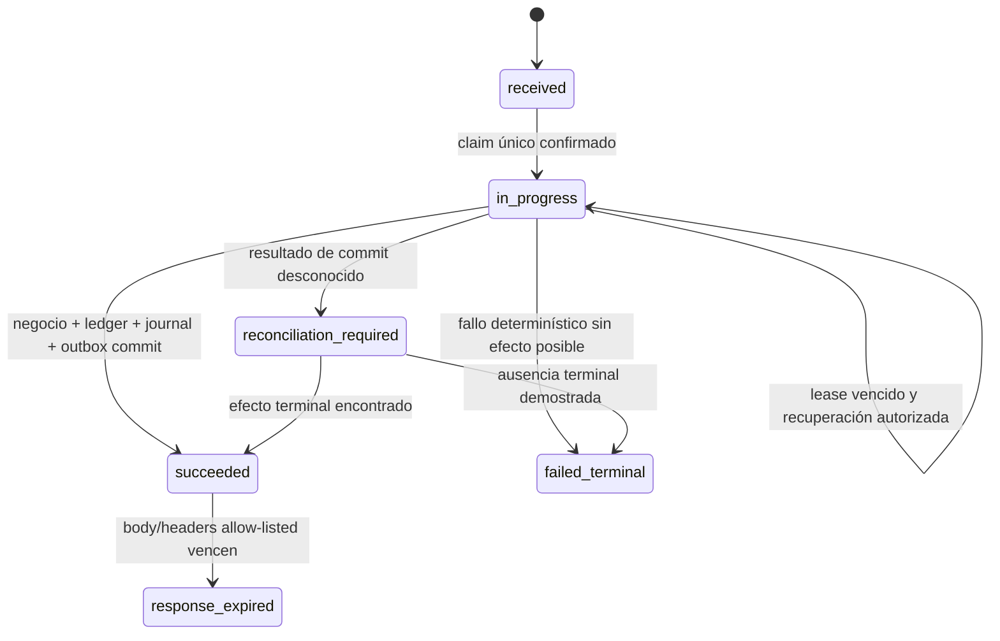

# Política de idempotencia y entrega de AGRO-FND-002

**Versión del protocolo:** `1.0.0`
**Estado:** decisión de diseño R1; no es evidencia de runtime ni autorización productiva.
**Tarea:** [`AGRO-FND-002`](../../backlog/EPIC-01-fundacion-arquitectura.md#agro-fnd-002).
**Primer consumidor nominado:** `CreateOrganization` de `AGRO-ID-003`, todavía futuro.

## Resultado y límites

Esta política fija un protocolo propio y versionado de AgropecuarIA para impedir que reintentos, dobles clics, concurrencia o resultados de commit inciertos creen más de un hecho de negocio. También fija cómo publicar y consumir los eventos resultantes al menos una vez sin afirmar transporte exactly-once.

El incremento es contractual. No crea un bounded context `Foundation`, una tabla genérica compartida, una migración, un endpoint, un dispatcher, un consumidor ficticio ni una dependencia de infraestructura. Tampoco promueve el spike descartable de `AGRO-DIS-003` al runtime. El módulo que incorpore una mutación posee su ledger, journal, outbox, migraciones y políticas RLS dentro de su schema, conforme a [ADR-009](../../../docs/adr/ADR-009-limites-modulares-y-compatibilidad.md).

`AGRO-FND-002` no satisface su Definition of Done con este documento. Debe permanecer `En curso` hasta que una mutación tenant real demuestre el protocolo integrado, sus controles de autorización/RLS y sus gates de crash, replay y delivery.

## Lenguaje normativo

`DEBE`, `NO DEBE`, `DEBERÍA` y `PUEDE` expresan obligaciones de este contrato AgropecuarIA. No heredan estatus normativo de un borrador externo.

El encabezado `Idempotency-Key` y algunas ideas de validación se inspiran en `draft-ietf-httpapi-idempotency-key-header-07`. Ese documento es un **Internet-Draft expirado**, archivado el 18 de abril de 2026, no un RFC ni un estándar activo. Por lo tanto, el contrato normativo es exclusivamente esta política y su versión; una implementación no puede atribuir conformidad IETF por seguirla.

## Invariantes no negociables

1. El servidor deriva actor, contexto `platform | tenant`, tenant y capacidades desde la sesión o identidad de job autenticada. Un ID enviado por el cliente es solo un locator.
2. La autorización vigente ocurre antes de consultar el ledger y se repite antes de cualquier replay. No se filtra si una key, recurso o respuesta existe.
3. Para una mutación tenant, la identidad lógica de deduplicación es `(tenant_id, operation, idempotency_key)`; el actor no pertenece a la unicidad, pero actor, recurso, versión de autorización y fingerprint quedan ligados al registro.
4. Misma identidad lógica, mismo contexto ligado y misma huella producen un único efecto y una respuesta allow-listed semánticamente equivalente. Cualquier diferencia ligada produce conflicto neutral y cero efecto nuevo.
5. Efecto de negocio, transición terminal del ledger, journal local y outbox se confirman en una única transacción PostgreSQL.
6. Expirar el body reproducible nunca permite repetir un hecho. El marcador durable y el locator de conciliación se conservan mientras la repetición pueda causar daño.
7. La entrega es at-least-once. Cada consumidor durable deduplica en inbox; no se promete exactly-once de transporte ni orden global.
8. Key cruda, fingerprint, payload crudo, actor, tenant, recurso y datos sensibles no son labels de métricas ni aparecen en logs o errores.
9. Cada claim/reclaim recibe un `fence_token` monotónico. La transacción terminal bloquea el ledger y verifica owner + fence vigentes **antes** de escribir negocio; un owner stale produce `stale_owner_zero_effect` y revierte sin efecto, journal de éxito ni outbox.

## Scope, unicidad y autoridad

### Mutaciones tenant

La forma canónica para una operación tenant es:

```text
UNIQUE (tenant_id, operation, idempotency_key_digest)
BOUND  (actor_id, resource_locator, authorization_version,
        contract_version, request_fingerprint)
```

- `tenant_id` se toma del contexto autenticado y se establece transaction-local para RLS; nunca se acepta como autoridad desde el body, query o header.
- `operation` es un identificador estable y versionado del caso de uso, no el nombre de una clase ni una URL concreta.
- `actor_id` queda fuera de la constraint para que una key no abra una segunda partición de efectos al cambiar de actor. Una coincidencia con actor distinto falla de forma neutral.
- `resource_locator` identifica el agregado o colección autorizada sin serializar una representación sensible.
- `authorization_version` cambia al revocar membresía, alcance, sesión o capacidad. Un replay con versión distinta exige reautorización y no devuelve el body histórico.
- Los registros tenant, ledger, journal, outbox e inbox DEBEN quedar sujetos a la misma defensa RLS `FORCE`, roles no propietarios y contexto transaction-local definida por `ADR-PEND-007`. RLS complementa, no reemplaza, autorización de aplicación.
- La key se resuelve únicamente dentro del scope ya derivado y autorizado. El servidor no hace lookup global ni consulta otro tenant para decidir conflicto.
- Reutilizar el mismo valor opaco en tenant A y tenant B crea identidades lógicas independientes. Cada scope puede ejecutar una vez su propio efecto autorizado; B no recibe conflicto, replay ni señal alguna por la existencia de A.

### Excepción explícita de bootstrap

`CreateOrganization` crea el tenant y, por [ADR-009](../../../docs/adr/ADR-009-limites-modulares-y-compatibilidad.md), es una operación platform-scoped de bootstrap. No existe un `tenant_id` confiable antes del efecto. `AGRO-ID-003` DEBE modelar esta excepción mediante la unión discriminada ya aprobada:

```text
tenant operation:   UNIQUE (scope_kind='tenant', scope_id=tenant_id, operation, key_digest)
platform bootstrap: UNIQUE (scope_kind='platform', scope_id=platform_namespace, operation, key_digest)
```

El namespace platform es constante del servidor, no un tenant sintético ni un valor del cliente. La autorización platform y su versión se ligan al registro. Después del commit, el ledger conserva el `organization_id` creado como locator del efecto para conciliar. Esta excepción no concede a un owner tenant capacidades platform ni relaja la unicidad tenant de las operaciones posteriores.

Los namespaces platform y tenant también son independientes: la misma key en `organization-bootstrap` y en un tenant no provoca conflicto cross-scope ni autoriza una búsqueda global. Los conflictos solo existen dentro de la misma tupla discriminada de scope + operación.

La migración, policy y autorización concretas pertenecen al futuro `AGRO-ID-003`; este documento no las implementa ni autoriza a inventar un tenant previo.

### Orden de evaluación de cada request o job

1. Autenticar y derivar actor, contexto, tenant cuando exista, sesión/capacidad y `authorization_version`.
2. Validar límite de payload, sintaxis de key y contrato de la operación.
3. Autorizar acción, recurso/colección y estado actual sin consultar el ledger.
4. Calcular digest de key y fingerprint canónico.
5. Intentar crear o cargar la fila exacta bajo constraint; comparar todo el contexto ligado.
6. Resolver conflicto, in-flight o replay sin revelar datos de otra autoridad.
7. Si es una ejecución nueva, abrir la unidad transaccional terminal y volver a validar las precondiciones mutables dentro de ella.

Los jobs siguen el mismo orden y ligan además `principal_kind`, capacidad y correlación. Un job sin contexto obligatorio falla antes de consultar o crear ledger.

## Contrato de `Idempotency-Key`

- Es obligatorio en las mutaciones declaradas idempotentes y corresponde a un único valor opaco de 16–128 caracteres ASCII visibles (`0x21`–`0x7E`). Lista, duplicado, valor vacío, caracteres fuera de ese rango o sintaxis ambigua se rechazan en el borde. Este contrato propio no adopta la serialización `sf-string` de RFC 9651.
- El valor decodificado tiene entre 16 y 128 caracteres ASCII visibles (`0x21`–`0x7E`). El cliente lo genera aleatoriamente con al menos 128 bits de entropía.
- Es opaco. No se deriva de UUID de negocio, tenant, actor, CUIT, timestamp, ruta ni texto humano.
- La key cruda solo vive durante el request. No se persiste, no se propaga en eventos y no aparece en journal, traces, logs, errores o labels.
- Cada ledger posee un `ledger_id` aleatorio y estable, que es su identidad canónica. La key cruda se representa solo mediante aliases `HMAC-SHA-256(key_version_secret, domain_separator || raw_key)`; el secreto está fuera de PostgreSQL y la comparación usa primitivas de tiempo constante donde sea observable.
- La tabla de aliases aplica `UNIQUE (scope_kind, scope_id, operation, key_version, key_digest)` y `UNIQUE (ledger_id, key_version)`. Cada alias referencia el mismo `ledger_id`; nunca constituye otro ledger ni otra oportunidad de efecto.
- Un claim calcula aliases para **todas** las versiones HMAC aceptadas y conservadas, las ordena por versión e intenta insertarlas en la misma transacción corta. Cualquier conflicto en cualquier versión resuelve al `ledger_id` existente; no crea una fila alternativa.
- Si los aliases calculados resuelven a más de un `ledger_id`, existe un `alias_identity_split`: la operación falla cerrada como `reconciliation_required`, preserva evidencia y no elige, fusiona, reescribe ni ejecuta ninguno de los ledgers.
- Durante coexistencia N/N-1, todos los writers N crean aliases para la versión actual y todas las versiones del key ring que N-1 todavía puede emitir. Así una carrera old/new comparte al menos el alias de la versión anterior y queda arbitrada por su constraint. Activar la nueva versión exige demostrar esa intersección con writers N/N-1 concurrentes en PostgreSQL real; no exige backfill de raw keys.
- Un registro preexistente no necesita backfill imposible: el request trae la key y el lookup calcula todos los HMAC retenidos. La fila se encuentra por su alias anterior y el writer N agrega lazy el alias actual al mismo `ledger_id` dentro de una transacción. Una colisión con otro ledger es `alias_identity_split`, no una resolución arbitraria.
- El material de cada versión se retiene hasta que ninguna fila que dependa de ella pueda causar reejecución y hasta retirar N-1. Eliminar una versión antes de ese gate falla cerrado como `reconciliation_required`; jamás trata la key como nueva.
- Una rotación que no pueda mantener lookup multiversión y aliases comunes debe conservar estable la clave lógica de identidad durante todo el horizonte de dedupe. Cambiar simplemente el HMAC de la columna única está prohibido porque evade la unicidad.

El nombre del header y estas reglas pertenecen a `AgropecuarIA Idempotency Protocol 1.0.0`; el draft IETF expirado es solo antecedente no normativo.

## Fingerprint canónico

La huella es `SHA-256` sobre bytes producidos por una canonicalización determinística y versionada por operación:

```text
fingerprint-v1 = SHA-256(
  length(http_method)       || http_method       ||
  length(route_template)    || route_template    ||
  length(contract_version)  || contract_version  ||
  length(normalized_payload)|| normalized_payload)
```

- Se usa el método normalizado y la **plantilla** de ruta, no la URL cruda, host, query incidental ni orden del router.
- `contract_version` identifica la semántica del command. Un cambio que altera equivalencia requiere otra versión de canonicalización/operación.
- `normalized_payload` se construye desde el command tipado después de validación: nombres canónicos, orden estable, Unicode normalizado, fechas UTC en formato único, decimal y unidades sin pérdida, `null`/ausente según el contrato. Para JSON compatible, [RFC 8785](https://www.rfc-editor.org/rfc/rfc8785.html) PUEDE ser la codificación, pero no reemplaza reglas de dominio explícitas.
- Datos derivados del servidor que deciden el efecto se incluyen en payload normalizado o en el contexto ligado. Headers de transporte, cookie, token y correlation ID no se incluyen.
- El payload crudo no se persiste ni registra. La huella tampoco es label y, si pudiera facilitar diccionario sobre baja entropía, se protege con un digest keyed separado o se conserva solo en la frontera cifrada aprobada.

## Máquina de estados

`received` es el estado lógico de admisión HTTP/job previo a una escritura durable. Para evitar una ventana adicional y estados sin dueño, el primer estado **persistido** es `in_progress`. El registro machine-readable enumera únicamente estados persistidos:



`reconciliation_required` es una condición operativa fail-closed, no una vía normal del ledger v1 ni permiso para reejecutar. Puede materializarse como flag/cola de conciliación sin ampliar silenciosamente el enum contractual. Si una implementación lo convierte en estado persistido público, requiere versión aditiva y compatibilidad N/N-1.

| Estado persistido | Significado | Respuesta/acción permitida |
|---|---|---|
| `in_progress` | La identidad está reclamada y ningún resultado terminal durable fue observado. | Duplicado devuelve `409 idempotency.in_progress` con `Retry-After`; no ejecuta en paralelo. |
| `succeeded` | Efecto, ledger terminal, journal y outbox compartieron commit. | Tras reautorizar y validar bindings, reproducir solo status/headers/body allow-listed o reconstruir por locator. |
| `failed_terminal` | Fallo determinístico y durable para el cual se demostró que ningún efecto pudo existir. | Reproducir Problem Details allow-listed. No se usa para timeouts, indisponibilidad ni commit incierto. |
| `response_expired` | El resultado reproducible venció, pero el efecto/dedupe marker permanece. | No reejecutar. Indicar lookup/conciliación autorizada y locator seguro. |

Transiciones distintas de las anteriores fallan cerradas. Un error transitorio no se cachea como `failed_terminal`. Un request no autorizado nunca crea ni cambia un estado de éxito.

## Concurrencia, leases y crash

### Claim de una key

- La corrección se apoya en la constraint de PostgreSQL y un `INSERT ... ON CONFLICT`/lock de **esa fila**, no en “check then insert”, memoria, cache o lock distribuido.
- El claim inicial es una transacción corta. Incluye `started_at_utc`, `lease_owner`, `lease_until_utc`, intentos, versión de concurrencia y `fence_token` entero monotónico asignado por PostgreSQL.
- Cada reclaim autorizado bloquea la fila e incrementa `fence_token`; nunca lo reutiliza ni lo toma del cliente. Overflow, secuencia ambigua o imposibilidad de persistir el incremento fallan cerrados.
- Antes de cualquier escritura de negocio, la transacción terminal ejecuta `SELECT ... FOR UPDATE` sobre el ledger y exige `state = in_progress`, `lease_owner = expected_owner` y `fence_token = expected_fence`. Luego la transición terminal repite esas condiciones mediante CAS. Cero filas afectadas produce rollback completo y `stale_owner_zero_effect`.
- El lock se conserva hasta que negocio, ledger terminal, journal y outbox confirman o revierten juntos. Un owner anterior que recupere CPU después del reclaim no puede mutar negocio, aunque todavía conserve memoria o un cancellation token tardío.
- Un duplicado observa el estado después de adquirir/esperar el lock de fila y responde según la tabla anterior.
- Un lease vencido no demuestra rollback. El recuperador abre una conexión/`DbContext` nuevo, reautoriza y relee ledger, invariante de negocio y outbox antes de reclamar e incrementar el fence.
- Reloj y lease usan tiempo de PostgreSQL. Los defaults de lease/timeout son configuración operativa validada, no constantes normativas ni retención legal.

`SKIP LOCKED` **NO DEBE** usarse al resolver el ledger de un request: puede ocultar la fila que decide corrección. PostgreSQL lo describe como una vista inconsistente apta para consumidores de tablas tipo cola, no para resolver unicidad/replay.

### Puntos de fallo

| Punto | Estado durable | Recuperación |
|---|---|---|
| Antes del claim | Nada | El próximo request puede intentar claim. |
| Después del claim, antes de la transacción de negocio | `in_progress` | Tras lease y relectura autorizada, recuperar incrementando fence; el owner anterior queda fenced out. |
| Antes del commit terminal | Se revierte negocio, terminal, journal y outbox | Verificar ausencia en conexión nueva; entonces puede retomarse una única ejecución. |
| Commit confirmado, respuesta perdida | `succeeded` y efecto completo | Reautorizar y reproducir/reconstruir el mismo resultado. |
| Conexión perdida durante commit | Desconocido para el proceso | Marcar conciliación, abrir conexión nueva y verificar ledger + efecto; responder indisponible si no puede demostrarse. Nunca retry ciego. |
| Después del efecto consumidor, antes de ack | Inbox/efecto deben compartir transacción | Redelivery se convierte en no-op por inbox. |

EF Core garantiza atomicidad de un único `SaveChanges` por defecto, pero el caso requiere una transacción explícita al agrupar más de un paso. Una estrategia de resiliencia debe ejecutar la unidad completa como bloque reintentable y tratar la incertidumbre durante commit mediante verificación. Mezclar una transacción manual con retries implícitos o volver a ejecutar el delegate sin reconciliar puede duplicar efectos.

## Unidad transaccional del productor

La transición terminal exitosa contiene, en este orden lógico, una sola transacción PostgreSQL:

1. lock del ledger y verificación de owner + `fence_token` + estado vigentes;
2. revalidación de agregado, versión, tenant y autorización mutable;
3. escritura del efecto de negocio;
4. actualización CAS `in_progress → succeeded`, condicionada otra vez por owner + fence, con locator y respuesta allow-listed;
5. inserción del journal local fail-closed;
6. inserción del evento tipado en outbox.

Un fence stale o un fallo de ledger, journal u outbox revierte toda la unidad, incluyendo cualquier escritura de negocio ya realizada dentro de ella. La publicación de red nunca ocurre dentro de esta transacción. Audit/Compliance central es una proyección eventual at-least-once: su caída no revierte un commit que ya dejó journal + outbox, pero sí eleva backlog y alerta.

El ledger vive en el schema del módulo productor. No hay repositorio genérico cross-module, FK contra otro schema ni `DbContext` compartido. El envelope público usa el catálogo de eventos de `AGRO-FND-001` y conserva `event_id`, scope, aggregate/version, correlation/causation y versión contractual.

## Delivery, inbox y orden

### Dispatcher de outbox

1. Reclama lotes pequeños de filas `pending/retry_due` mediante lease.
2. PUEDE usar `FOR UPDATE SKIP LOCKED` únicamente aquí, porque la outbox es una cola y cada fila omitida sigue disponible para otro worker.
3. Confirma el claim en una transacción corta; no mantiene locks durante I/O.
4. Entrega fuera de la transacción y registra ack o retry en una transacción nueva con compare-and-set del lease.
5. Un lease vencido vuelve a ser elegible; un ack repetido es idempotente.

El dispatcher no interpreta reglas de negocio ni marca `dispatched` antes de la confirmación durable del destino. Los límites de lote, timeout y paralelismo son configuración medible por consumer/operación.

### Retry, backoff y poison

- Cada error se clasifica explícitamente `retryable` o `terminal`. Timeout, `429` y `5xx` pueden ser retryable según contrato; schema/major desconocida, payload inválido o policy prohibida son terminales.
- Retry usa exponential backoff con full jitter, base inicial y tope configurables. La implementación fija y prueba valores contra Q-020 antes de habilitar el consumidor; no reintenta indefinidamente.
- El presupuesto de intentos es acotado y versionado por consumidor. Al agotarlo, o ante error terminal, **la fila de delivery/outbox** pasa a `delivery_poisoned`/quarantine con reason code allow-listed, primer/último fallo y correlación; nunca payload/secreto en el error.
- `delivery_poisoned` no es `failed_terminal` del ledger. El ledger ya permanece `succeeded` o `response_expired` porque el efecto productor confirmó. Un fallo posterior de transporte jamás reescribe el resultado de negocio como fallido.
- `failed_terminal` se reserva al request idempotente cuando se demostró que ningún efecto de negocio pudo existir. El dispatcher y los consumers usan su propia máquina `pending | leased | retry_due | dispatched | delivery_poisoned`.
- La conciliación manual requiere actor autorizado, motivo, journal y operación reproducible. “Retry now” no salta authz, schema ni orden.

### Inbox y efecto consumidor

- Constraint mínima `UNIQUE (consumer, event_id)`; el tenant sigue presente y protegido por RLS, pero no sustituye identidad global del evento por consumidor.
- La inserción de inbox, efecto del consumidor y avance de versión del stream comparten una transacción local.
- Un duplicado ya completado se reconoce y se confirma sin repetir el efecto.
- Un crash antes del commit permite redelivery; después del commit la fila inbox demuestra el efecto local.

### Orden

- Solo se garantiza orden por `aggregate_type + aggregate_id` y versión monotónica del stream.
- No se afirma orden global, entre agregados ni entre tenants.
- Un evento repetido o atrasado es duplicate/no-op si coincide con el ya aplicado. Un gap, una versión repetida con contenido incompatible o una major no soportada entra en cuarentena sin efecto parcial.
- Para preservar orden, hay a lo sumo un evento en vuelo por stream. Un stream bloqueado no detiene otros agregados; su edad/gap queda visible y requiere conciliación.

## Retención operativa

- La ventana de replay de respuesta es configurable por operación y debe cubrir el horizonte máximo demostrado de retry cliente/edge. No se fija como retención legal.
- Al vencer, se descartan únicamente body y headers reproducibles permitidos; permanece el binding, fingerprint, estado terminal y locator necesarios para impedir otro efecto.
- Desarrollo local no ejecuta auto-purge. Valores ausentes, cero, negativos o menores al horizonte seguro fallan startup de la capacidad.
- Purga, archivo, legal hold, restore y plazo de ledger/outbox/inbox/poison/journal permanecen `NO-GO` hasta cerrar `Q-060`, `VAL-LEG` y la [política complementaria](audit-retention-and-threats.md). Ningún TTL técnico responde obligaciones fiscales, contables o de privacidad.
- Restaurar backup no puede reactivar una key consumida. Todo futuro purge debe probar backup/restore, tombstones, hold y deduplicación posterior.

## Compatibilidad N/N-1 y rollout

1. La primera migración es `expand`: tablas/columnas/índices nuevos y lectores tolerantes. Estados se almacenan como texto validado por aplicación/constraint aditiva, no como un enum PostgreSQL imposible de ampliar durante coexistencia.
2. N y N-1 deben poder leer filas existentes. Nuevos campos empiezan nullable o con default compatible y se vuelven obligatorios solo después de backfill/verificación y retiro de N-1.
3. La ruta idempotente se habilita por operación y solo en nodos N que soportan protocolo `1.0.0`. N-1 no procesa esa operación ni ofrece un camino alternativo sin ledger.
4. La versión de canonicalización y contrato se persiste. N nunca reinterpreta una fingerprint N-1 con reglas nuevas.
5. Producer y consumer declaran major/rango compatibles. Campos aditivos se ignoran; major desconocida se cuarentena.
6. Rollback de aplicación apaga la capacidad/ruta, conserva ledger, journal, outbox, inbox y poison, y prefiere roll-forward. No ejecuta down migration destructiva mientras convivan versiones.
7. El ensayo de upgrade N-1→N, escrituras de ambos, rollback de binario y roll-forward debe probar que no aparece un segundo efecto ni se pierden eventos.

## Primer consumidor y secuencia de dependencias

`CreateOrganization` de `AGRO-ID-003` es el primer consumidor **nominado**, no implementado. Su valor es demostrar el patrón en una capacidad real que crea el tenant y después habilita aislamiento. La secuencia vinculante es:

1. `AGRO-FND-002` publica esta política, la política de auditoría/amenazas, el registro machine-readable y el validador. Esto puede cerrar la DoR documental, no la DoD.
2. En una instrucción futura explícita, `AGRO-ID-003` implementa `CreateOrganization`, su scope platform de bootstrap, organización/membresía inicial, autorización, ledger/journal/outbox, migración productiva y `FORCE RLS`/roles/contexto definidos por `ADR-PEND-007`.
3. El mismo slice aporta pruebas de tenant A/B, ausencia de contexto, pool, job, concurrencia, crash/replay y telemetría. No copia ni referencia runtime del spike `AGRO-DIS-003`.
4. Una revisión independiente integra esa evidencia en `AGRO-FND-002`. Recién entonces la tarea puede evaluarse contra DoD.
5. `AGRO-SEC-002` amplía cobertura a otras rutas/jobs/caches/exports; no sustituye autorización de aplicación ni el primer consumidor.

Esta secuencia resuelve la dependencia circular de planificación sin absorber `AGRO-ID-003`, anticipar roles definitivos ni fabricar un endpoint para “probar” infraestructura.

## Telemetría y runbook

### Métricas mínimas

| Señal | Propósito | Dimensiones allow-listed |
|---|---|---|
| `idempotency.requests` | nuevos, replay, conflict, in-progress, response-expired | `operation`, `state`, `outcome`, `contract_major` |
| `idempotency.commit_unknown` | resultados que requieren conciliación | `operation`, `outcome` |
| `idempotency.lease_recovered` | recuperación de claims abandonados | `operation`, `outcome` |
| `outbox.backlog` / `outbox.oldest_age` | capacidad y estancamiento | `event_type`, `contract_major` |
| `outbox.delivery_attempts` | retry/terminal/poison | `consumer`, `outcome`, `reason_code` |
| `inbox.duplicates` | redelivery absorbida | `consumer`, `event_type` |
| `event_stream.gaps` | orden/quarantine | `consumer`, `event_type`, `reason_code` |

Las dimensiones son enums/allow-lists de cardinalidad acotada. Key, digest, fingerprint, tenant, actor, resource, event ID, payload, CUIT y correlation ID quedan fuera de labels. Logs/traces pueden conservar una correlación opaca aprobada, nunca secretos o body.

### Procedimientos mínimos

- **`in_progress` envejecido:** pausar reclaim automático si supera umbral; reautorizar, inspeccionar ledger/efecto/outbox en conexión nueva, renovar o conciliar con journal.
- **Commit desconocido:** no reenviar command. Verificar terminal + locator; si PostgreSQL no permite demostrarlo, devolver indisponible y mantener `reconciliation_required`.
- **Key reutilizada en el mismo scope:** devolver `409 idempotency.key_reused`, sin indicar qué campo, actor o recurso difiere. Nunca buscar otro tenant/platform namespace para decidir esa respuesta.
- **Respuesta expirada:** reautorizar lookup del locator; nunca convertir el request en ejecución nueva.
- **Poison/retry agotado:** detener ese stream, preservar evidencia, clasificar schema/major/fallo y ejecutar conciliación autorizada; otros streams continúan.
- **Gap:** comparar versión esperada/recibida y recuperar evento faltante desde outbox autoritativa. No saltar versión manualmente sin journal.
- **Cambio de `authorization_version`:** negar replay y body histórico; el operador no “corrige” bindings en la fila.

Alertas se definen sobre edad y tasa, no IDs. Los umbrales productivos, soporte y escalamiento siguen abiertos con Q-020/Q-060 y deben constar en el runbook del consumidor antes de habilitarlo.

## Alternativas evaluadas

| Alternativa | Decisión y trade-off |
|---|---|
| Actor dentro de la constraint | Rechazada. Permitiría una segunda partición de efectos con la misma key al cambiar de actor. Se liga y reautoriza, pero no forma parte de unicidad. |
| Cache/lock distribuido como fuente de verdad | Rechazada. No comparte commit con negocio y pierde corrección ante evicción/partición. Puede aliviar lectura, nunca decidir efecto. |
| Persistir key o request crudos | Rechazada por secretos, PII y abuso de observabilidad. Se conservan digests y respuesta mínima allow-listed. |
| Reemplazar el HMAC único al rotar | Rechazada: el mismo raw key adquiere otro digest y puede evadir la constraint. Se usa `stable_ledger_identity` + `multi_version_lookup_aliases`, con intersección N/N-1 demostrada. |
| `SKIP LOCKED` en el ledger HTTP | Rechazada. Una fila omitida puede aparentar ausencia y duplicar el hecho. Solo se admite en outbox queue-like. |
| Exactly-once de transporte | Rechazada. La garantía alcanzable es efecto local único mediante outbox at-least-once + inbox idempotente. |
| Orden global o por tenant | Rechazada por acoplamiento y contención. Solo orden del aggregate stream. |
| Ledger/repositorio genérico compartido | Rechazada por ownership modular y migraciones cruzadas. Se comparte protocolo/fitness, no persistencia. |
| Llamada externa dentro de la transacción | Rechazada: prolonga locks y no vuelve atómico un sistema remoto. Se registra outbox y entrega después. |
| Reintentar ciegamente un commit incierto de EF Core | Rechazada: puede duplicar un commit que sí ocurrió. Se reconstruye/verifica estado en conexión nueva. |

## Gates de aceptación

### Incremento contractual actual

- Este archivo, [política de auditoría/amenazas](audit-retention-and-threats.md), `foundation-protocol.json` y su validador son coherentes y UTF-8 válido.
- El validador rechaza mutaciones de scope/unicidad, key, fingerprint, autorización, estados, atomicidad, exactly-once, orden, retry, retención, consumidor futuro y falsa evidencia runtime.
- Las referencias locales existen; links primarios identifican claramente el draft expirado y las garantías reales de EF Core/PostgreSQL.
- Secrets/PII scan y `git diff --check` pasan.
- No hay cambios en `src/`, `apps/`, migraciones, contratos productivos, paquetes, frontend ni infraestructura.

Los gates .NET, frontend, PostgreSQL y E2E son `N/A` para este incremento porque no hay runtime. No pueden marcarse verdes por ejecutar fixtures documentales.

### Primer consumidor runtime futuro

La DoD de `AGRO-FND-002` requiere evidencia reproducible, como mínimo, de:

1. mismo key/fingerprint concurrente: exactamente un efecto, un terminal, un journal y una outbox; reclaim concurrente prueba que solo owner + fence vigente puede escribir y que el owner stale produce cero efectos;
2. dentro del mismo scope, misma key con cambio individual de fingerprint/actor/recurso/auth-version: conflicto o denegación neutral y cero efecto;
3. tenant A y tenant B usan la misma key de forma independiente: cada uno ve únicamente su ledger y puede producir su único efecto autorizado; no hay lookup, conflicto ni oracle cross-tenant. El namespace platform también queda aislado;
4. rotación HMAC con aliases old/current, writers N-1/N concurrentes y filas previas: un solo `ledger_id`, constraints sin bypass, lazy alias sin backfill de raw key y versión retirada fail-closed; aliases que apuntan a más de un ledger producen `alias_identity_split`/conciliación y cero efecto;
5. replay autorizado, permiso revocado entre commit/replay, in-flight `409 + Retry-After` y response-expired sin reejecución;
6. crash antes de commit, después de commit/antes de response y conexión perdida durante commit;
7. negocio + ledger + journal + outbox atómicos bajo fallo inyectado de cada participante;
8. delivery duplicado, crash efecto/ack, lease vencido, backoff/jitter acotado, `delivery_poisoned`, gap y orden por agregado; el ledger productor continúa succeeded;
9. PostgreSQL real con tenant A/B, sin contexto, actor ajeno, pool tras commit/rollback/excepción/cancelación y job sin scope;
10. migración `expand`, writer N-1/N, rollback de aplicación y roll-forward sin pérdida ni duplicado;
11. métricas/logs/traces emitidos y útiles, con labels acotadas y canaries ausentes;
12. runbook reproducido y revisión independiente QA/AppSec/Data/SRE sin hallazgos altos o críticos.

## Fuentes primarias y trazabilidad

- [IETF Datatracker — draft-ietf-httpapi-idempotency-key-header-07](https://datatracker.ietf.org/doc/draft-ietf-httpapi-idempotency-key-header/07/): Internet-Draft expirado y archivado; antecedente no normativo.
- [RFC 9651 — Structured Field Values for HTTP](https://www.rfc-editor.org/rfc/rfc9651.html): antecedente técnico no normativo; AgropecuarIA no adopta `sf-string` para este header.
- [RFC 8785 — JSON Canonicalization Scheme](https://www.rfc-editor.org/rfc/rfc8785.html): alternativa de serialización JSON determinística, subordinada al command tipado.
- [RFC 9110 — Retry-After](https://www.rfc-editor.org/rfc/rfc9110.html#name-retry-after): semántica del header de espera.
- [EF Core — Transactions](https://learn.microsoft.com/ef/core/saving/transactions): atomicidad, transacciones explícitas y savepoints.
- [EF Core — Connection resiliency and commit failure](https://learn.microsoft.com/ef/core/miscellaneous/connection-resiliency#transaction-commit-failure-and-the-idempotency-issue): transacciones como unidad de retry y resultado incierto durante commit.
- [PostgreSQL — `SELECT`, locking y `SKIP LOCKED`](https://www.postgresql.org/docs/current/sql-select.html): uso queue-like y vista inconsistente.
- [PostgreSQL — Transaction isolation](https://www.postgresql.org/docs/current/transaction-iso.html): concurrencia y relectura.
- [PostgreSQL — `INSERT ... ON CONFLICT`](https://www.postgresql.org/docs/current/sql-insert.html): arbitraje por índices únicos.
- [ADR-009 — límites modulares y N/N-1](../../../docs/adr/ADR-009-limites-modulares-y-compatibilidad.md).
- [ADR-PEND-007 y preguntas abiertas](../../decisions-and-gaps.md).
- [Política complementaria de auditoría, retención y amenazas](audit-retention-and-threats.md).

## Riesgos residuales y decisiones pendientes

- `CreateOrganization` sigue sin contrato funcional, autorización, modelo de membresía ni migración productiva; pertenecen a `AGRO-ID-003`.
- ADR-PEND-007 está aceptada para desarrollo, pero el runtime aún no tiene RLS tenant, principals separados ni contexto transaccional.
- Q-020 no aporta todavía volumen representativo para fijar tamaño de lote, leases, retry budget, índices o umbrales.
- Q-060, GAP-003 y VAL-LEG mantienen abiertos proveedor, SLA, soporte, región, retención, legal hold y purga.
- Audit/Compliance central, dispatcher, inbox, poison store y conciliación humana no existen; no se afirma delivery productivo ni WORM.
- La incertidumbre de commit no desaparece por usar EF Core. El primer consumidor debe demostrar reconciliación con fallos inyectados y una invariante de negocio observable.
