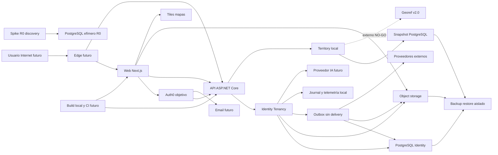

# AgropecuarIA — threat model central

## Executive summary

AgropecuarIA ya contiene un bootstrap productivo ejecutable local acotado: web Next.js, API ASP.NET Core, módulos Identity/Tenancy y Territory, PostgreSQL, OpenAPI, sesiones OIDC, bootstrap/invitación tenant y referencia territorial oficial (`apps/AgropecuarIA.Api/Program.cs`; `contracts/identity.openapi.yaml`; `contracts/territory.openapi.yaml`). Territory busca sobre un snapshot local inmutable de las 23 provincias más CABA; la resolución explícita de coordenadas usa un adapter fijado a Georef v2.0 y degrada a `stale|unavailable` con búsqueda manual. Las coordenadas exactas no se persisten, journalizan, guardan en navegador ni registran por la aplicación, aunque viven temporalmente en un caché volátil acotado y viajan como query al proveedor. No existe todavía despliegue compartido, edge, proveedor externo aprobado, worker de delivery, storage ni CI. Los controles locales se consideran evidencia únicamente para los slices integrados y sus tests; nunca certifican proveedor, Legal, región, SLA o producción.

## Scope and assumptions

### Alcance

- Arquitectura objetivo: aplicación Next.js/React separada, API/BFF ASP.NET Core, monolito modular, worker, PostgreSQL/PostGIS, object storage privado y proveedores externos (`docs/05-arquitectura.md`, “Decisión principal” y “Stack de referencia”).
- Límites y flujos entre los 15 módulos documentados, incluyendo Identity/Tenancy, Documents, Audit/Compliance, Integrations y Analytics/AI (`tasks/evidence/AGRO-FND-001/module-boundaries.json`; `tasks/evidence/AGRO-FND-001/consumer-map.json`).
- Datos, identidad, archivos, GIS/clima, IA, telemetría, backup/restore, build y futura promoción de artefactos (`docs/07-seguridad-y-privacidad.md`; `tasks/release-plan.md`).
- Runtime local integrado bajo `apps/AgropecuarIA.Api`, `apps/web`, `src/AgropecuarIA.Identity` y `src/AgropecuarIA.Territory`, sus contratos OpenAPI, migraciones EF y suites bajo `tests/`.
- Evidencia R0 bajo `tasks/evidence/` solo como fuente de hipótesis y controles a reproducir. Los fixtures son sintéticos y los prototipos no se reutilizan sin una revisión de implementación (`README.md`; `tasks/release-plan.md`, “R0”).

### Fuera de alcance

- Certificación legal, dictamen AAIP, aprobación contractual de proveedor, selección de región, DPA o plazos legales de retención (`tasks/decisions-and-gaps.md`, `VAL-LEG` y `GAP-003`).
- ARCA, offline, mapas descargables, Kubernetes, microservicios y herramientas de IA con autoridad de escritura (`docs/01-vision-y-alcance.md`; `docs/05-arquitectura.md`; `docs/08-estrategia-ia.md`).
- Afirmar controles productivos, SLA, RPO/RTO o exposición de red reales donde solo existen especificaciones o laboratorios locales (`tasks/evidence/AGRO-DIS-005/validation-report.md`; `tasks/evidence/AGRO-DIS-007/validation-report.md`).

### Supuestos explícitos y preguntas abiertas

- Se asume un SaaS web expuesto a Internet y online-only, con usuarios autenticados y organizaciones aisladas; el hosting y edge definitivos no están elegidos (`docs/05-arquitectura.md`; `tasks/release-plan.md`).
- `Organization` es el tenant operativo y el servidor deriva tenant, actor y permisos; CUIT no selecciona contexto (`docs/adr/ADR-009-limites-modulares-y-compatibilidad.md`; `tasks/evidence/AGRO-FND-001/README.md`).
- `ADR-PEND-007` está aceptada como dirección de desarrollo R1: `FORCE RLS` default-deny, owners `NOLOGIN`, principals runtime sin ownership ni `BYPASSRLS` y contexto transaccional. `CreateOrganization` reproduce esa dirección en su frontera acotada; el discovery actor-scoped 0/1/N general sigue demostrado únicamente por el spike `AGRO-DIS-003` (`tasks/decisions-and-gaps.md`; `tasks/evidence/AGRO-ID-003/validation-report.md`).
- `Q-054` sigue abierta para el cliente comercial inicial. Cambia escala, abuso administrativo y necesidades de soporte, pero no el aislamiento técnico por organización (`docs/11-preguntas-discovery.md`; `tasks/decisions-and-gaps.md`, defaults de `AGRO-DIS-003`).
- `Q-055` sigue abierta para propiedad/control contractual entre propietario, productor y asesor. Hasta resolución, membresía no implica transferencia de propiedad ni acceso entre clientes (`docs/11-preguntas-discovery.md`; `tasks/decisions-and-gaps.md`, `GAP-008`).
- `Q-058` sigue abierta para proveedor internacional y región de procesamiento. Toda transferencia o proveedor afectado queda en NO-GO productivo hasta `VAL-LEG` (`docs/11-preguntas-discovery.md`; `tasks/decisions-and-gaps.md`, `VAL-LEG`).
- `Q-060` sigue abierta para SLA, soporte y retención. 99,9 %, RPO 15 min y RTO 2 h son targets de ingeniería, no compromisos contractuales (`docs/09-calidad-y-pruebas.md`; `tasks/decisions-and-gaps.md`, defaults de `AGRO-DIS-007`).

El sponsor delegó decisiones técnicas reversibles y pidió continuar sin nuevos checkpoints; por eso este incremento avanza con esos supuestos explícitos. Q-054/055/058/060 no fueron cerradas y elevan la incertidumbre de TM-009, TM-011, TM-013 y TM-014; prohíben certificar Legal, proveedor o producción.

## System model

### Primary components

**Bootstrap productivo integrado local, no desplegado.** Next.js/React sirve Identity y “Referencia territorial” por same-origin sobre la API ASP.NET Core. Identity/Tenancy posee su schema, journal y outbox. Territory posee un snapshot oficial local inmutable, búsqueda estricta, resolución explícita de coordenadas, caché volátil acotado y adapter Georef v2.0. La composition root registra cookies, antiforgery, rate limiting, no-store, OIDC y OpenTelemetry local (`apps/AgropecuarIA.Api/Program.cs`; `src/AgropecuarIA.Identity/Infrastructure/IdentityDbContext.cs`; `src/AgropecuarIA.Territory/TerritoryServiceCollectionExtensions.cs`).

**Runtime futuro.** Worker con outbox/inbox, PostGIS productivo, object storage privado, proveedores GIS/clima/correo y, en R6, IA continúan como arquitectura objetivo. El adapter Georef existe y se prueba localmente, pero el tráfico externo real permanece `NO-GO`: faltan licencia/atribución, región, DPA, retención, subencargados, SLA/cuota, egress administrado y redacción end-to-end de URLs. Los módulos poseen sus schemas y solo consumen contratos públicos (`docs/05-arquitectura.md`; `tasks/release-plan.md`).

**Build, CI y desarrollo.** Existe la solución raíz `AgropecuarIA.slnx`, locks NuGet por proyecto, tool manifest y aplicación web con `pnpm-lock.yaml`; los gates locales ejecutan restore locked/frozen, build, tests, format y SCA. No existe pipeline, identidad de CI, SBOM/provenance, registro de artefactos ni deploy; esas superficies siguen developer-controlled hasta `AGRO-PLT-001/002` (`global.json`; `src/AgropecuarIA.Identity/packages.lock.json`; `apps/web/package.json`; `tasks/evidence/AGRO-ID-002/validation-report.md`).

**Tests y ejemplos.** Las suites raíz prueban el runtime contra PostgreSQL efímero real y navegador Chromium. Los endpoints sintéticos incluyen sign-in anónimo intencional y solo se mapean cuando coinciden environment Development/Test y flag local; una clasificación errónea de ambiente compartido sería un bypass crítico, por lo que se prueba su ausencia en Production. Los spikes R0 continúan aislados y descartables. En particular, `AGRO-DIS-003` usa su propio API, roles, scripts y clúster efímero para demostrar discovery de membresías; no forma parte de `AgropecuarIA.slnx`, de `src/` ni de `apps/` (`tests/AgropecuarIA.Identity.Tests/IdentitySessionSecurityTests.cs`; `tasks/evidence/AGRO-DIS-003/README.md`).

### Data flows and trust boundaries

- **Internet/usuario → edge futuro → web/API:** el runtime está pensado para HTTPS público, pero hoy solo se prueba localmente. La API aplica cookies `HttpOnly`/`Secure`/`SameSite`, antiforgery, rate limits, headers de no-cache y forwarded headers configurados; TLS/origin lockdown, CSP/WAF y proxies confiables requieren ambiente compartido (`apps/AgropecuarIA.Api/Program.cs`; `tests/AgropecuarIA.Identity.Tests/IdentitySessionSecurityTests.cs`).
- **Navegador → API Identity:** sesión opaca, antiforgery, login, link/unlink, step-up, revocación, bootstrap de organización e invitaciones co-owner cruzan REST/JSON/OpenAPI. El servidor deriva actor/scope, revalida identidad/sesión, limita tasa y devuelve Problem Details cerrados; los contextos tenant efectivos están acotados a `CreateOrganization` e invitaciones y no constituyen todavía un discovery o CRUD tenant general (`apps/AgropecuarIA.Api/IdentityEndpoints.cs`; `contracts/identity.openapi.yaml`; `tests/AgropecuarIA.Identity.Tests/OrganizationOwnerInvitationApiTests.cs`).
- **Navegador ↔ Auth0 objetivo → API:** Authorization Code + PKCE, state/nonce del middleware, `max_age=0`, `auth_time`, ACR/AMR y issuer/subject alimentan sesiones y step-up. El proveedor sintético está físicamente limitado a Development/Test; Auth0 real, email, lifecycle de factores y DPA/región siguen pendientes (`apps/AgropecuarIA.Api/OidcReauthentication.cs`; `apps/AgropecuarIA.Api/IdentityEndpoints.cs`; `tasks/evidence/AGRO-ID-002/validation-report.md`).
- **API Identity → PostgreSQL runtime:** usuarios, identidades, sesiones, organizaciones, memberships, ledger idempotente, journal y outbox se escriben mediante EF Core y migraciones aditivas. `CreateOrganization` cambia a un rol mínimo dentro de la transacción, fija actor/scope/organización server-side y opera bajo `FORCE RLS`; PostgreSQL efímero prueba A/B/sin contexto, pool/job, concurrencia, N/N-1 y rollback/roll-forward. Esa evidencia no habilita todavía discovery general ni controles de otros módulos (`src/AgropecuarIA.Identity/Infrastructure/IdentityDbContext.cs`; `tests/AgropecuarIA.Identity.Tests/OrganizationDatabaseSecurityTests.cs`).
- **Navegador autenticado → API Territory → snapshot PostgreSQL local:** autocomplete reactivo y formulario explícito de latitud/longitud consumen dos GET autenticados, limitados por sesión y con `no-store`. Search lee únicamente el snapshot activo validado; roles sin privilegio, `FORCE RLS`, snapshot hash/completo e inmutabilidad publicada se prueban contra PostgreSQL real (`contracts/territory.openapi.yaml`; `tests/AgropecuarIA.Territory.Tests/TerritoryDatabaseSecurityTests.cs`).
- **API Territory → Georef v2.0:** solo resolve explícito envía latitud/longitud a `https://apis.datos.gob.ar/georef/api/v2.0/ubicacion`; no envía tenant, nombre de campo ni parcela. Redirects, cookies y descompresión automática están deshabilitados; hay timeout de 5 s, máximo 256 KiB y parser estricto. La aplicación no registra ni persiste coordenadas exactas; el caché bitwise es volátil/acotado. Aun así, la URL puede aparecer en infraestructura externa no validada, por lo que todo tráfico real queda `NO-GO` hasta redacción y aprobación de proveedor (`src/AgropecuarIA.Territory/Providers/Georef/GeorefTerritoryClient.cs`; `src/AgropecuarIA.Territory/Application/TerritoryResolutionCache.cs`).
- **API del spike R0 → PostgreSQL de discovery:** el servidor deriva el actor de su sesión, abre una transacción dedicada y ejecuta `set_config('app.current_actor_id', ..., true)` antes de consultar. `agro_membership_discovery` es un login separado, read-only, `NOINHERIT`, `NOBYPASSRLS`, sin ownership ni acceso a identidad global o datos tenant; las policies actor-scoped devuelven únicamente membresías y organizaciones activas propias. El harness local exige SCRAM-SHA-256, secretos efímeros distintos y ACL owner-only. Esta frontera reduce incertidumbre de diseño, pero vive bajo `tasks/evidence/`, no es una ruta del runtime ni prueba credenciales, red o grants de un ambiente compartido (`tasks/evidence/AGRO-DIS-003/membership-discovery-decision.md`; `tasks/evidence/AGRO-DIS-003/validation-report.md`).
- **API → grant; navegador → object storage; storage/scanner → worker/API:** binarios, hashes, metadata, grants, eventos y verdicts cruzan dos fronteras directas. Se exigen autorización antes de emitir y consumir el grant, cuarentena privada, MIME/tamaño/hash, único verdict `clean`, grants breves ligados a tenant/recurso y reconciliación; proveedor, KMS, WORM y scanner productivos no están aprobados (`docs/07-seguridad-y-privacidad.md`; `tasks/evidence/AGRO-DIS-005/validation-report.md`).
- **Navegador → proveedor de tiles/style:** IP, viewport y zona solicitada salen directamente a un host allow-listed bajo CSP; no se envían tenant, nombre de campo ni polígono completo. Términos, región/logs, minimización y fallback tabular siguen siendo gates (`tasks/evidence/AGRO-DIS-004/source-and-license-matrix.md`; `tasks/evidence/AGRO-SEC-001/provider-processing-inventory.md`, `PI-04`).
- **Worker ↔ proveedores GIS/clima/webhooks:** coordenadas minimizadas, GeoJSON, XML CAP, NetCDF, snapshots y checkpoints por endpoints fijados. Se requieren allow-list, límites de redirects/DNS, schema/unidades/frescura, autenticidad, idempotencia y fallback; las pruebas live R0 no prueban SLA ni canal productivo (`tasks/evidence/AGRO-DIS-004/validation-report.md`; `docs/06-integraciones-y-normativa.md`).
- **API/worker ↔ proveedor IA:** prompts, paquetes mínimos de evidencia y respuestas solo en R6. Debe reautorizarse antes y después, usar tools read-only, cálculo determinístico, abstención y kill switch; proveedor, región, retrieval y evals no existen aún (`docs/08-estrategia-ia.md`; `tasks/release-plan.md`, “R6”).
- **Runtime Identity → telemetría/journal/outbox:** OpenTelemetry ASP.NET Core y métricas Identity emiten dimensiones acotadas; tests impiden tokens, cookies, labels de identidad y cardinalidad de propósito libre. Un trigger PostgreSQL bloquea UPDATE/DELETE del journal local y journal+outbox son atómicos en linking/step-up exitosos; no hay WORM/grants separados y no todos los rechazos/revocaciones producen outbox. No sustituyen Audit/Compliance o delivery; collector/backend/retención siguen pendientes (`apps/AgropecuarIA.Api/Program.cs`; `src/AgropecuarIA.Identity/Infrastructure/Migrations/20260806002243_InitialIdentity.cs`; `tests/AgropecuarIA.Identity.Tests/IdentityTelemetryTests.cs`).
- **Runtime → backup → restore aislado:** DB/PostGIS, objetos y cadena de auditoría. Se requieren PITR, inmutabilidad, principals separados, manifests y reconciliación; solo existe un drill local sintético y el RPO administrado no está probado (`tasks/evidence/AGRO-DIS-005/validation-report.md`; `tasks/backlog/EPIC-16-plataforma-observabilidad-operacion.md`, `AGRO-PLT-004`).
- **Developer/registro de paquetes → build local → artefactos:** .NET y pnpm resuelven manifests bloqueados y pasan SCA/secrets local. CI, runner identity, SBOM/provenance, firma y registro siguen futuros; una máquina de desarrollo comprometida aún puede producir un binario no atestado (`src/AgropecuarIA.Identity/packages.lock.json`; `apps/AgropecuarIA.Api/packages.lock.json`; `apps/web/pnpm-lock.yaml`; `AGRO-PLT-002`).

#### Diagram

## Assets and security objectives

| Asset | Why it matters | Security objective (C/I/A) |
|---|---|---|
| Identidades, bindings, factores y sesiones | Una toma de cuenta habilita acceso y acciones en nombre del usuario | C/I/A |
| Datos tenant de producción, inventario y finanzas | Una fuga o alteración puede causar daño comercial y decisiones erróneas | C/I/A |
| Ubicación, geometrías y productividad | Revelan operación física y condicionan cálculos/historia | C/I/A |
| Documentos y archivos originales | Pueden contener datos personales/fiscales y payload hostil | C/I/A |
| Catálogo, perfiles, clima y alertas oficiales | Su integridad/frescura afecta reglas y recomendaciones a escala | I/A |
| Evidencia y recomendaciones de IA | Deben ser autorizadas, explicables y nunca fuente de cálculo crítico | C/I/A |
| Outbox/inbox, versiones y hechos históricos | Sostienen exactly-once, rectificación y trazabilidad temporal | I/A |
| Auditoría de negocio y seguridad | Permite atribución, detección, investigación y cumplimiento | C/I/A |
| Secretos, tokens, claves y credenciales de proveedor | Su exposición cruza fronteras y puede comprometer todos los tenants | C/I |
| Backups, manifests y claves de recuperación | Son la última defensa frente a corrupción o ransomware | C/I/A |
| Código, dependencias y artefactos de release | Un artefacto comprometido distribuye el ataque al runtime | I/A |
| Presupuesto, cuotas y capacidad online | El producto no tiene modo offline y depende de disponibilidad controlada | A |

Evidencia: clasificación y objetivos en `docs/07-seguridad-y-privacidad.md`; invariantes de datos en `docs/04-reglas-y-modelo-de-datos.md`; ownership en `tasks/evidence/AGRO-FND-001/module-boundaries.json`.

## Attacker model

### Capabilities

- Atacante remoto anónimo capaz de explorar superficies públicas, automatizar recovery/login, enviar inputs malformados y consumir cuota cuando exista exposición (`docs/07-seguridad-y-privacidad.md`).
- Miembro autenticado de un tenant que conoce o adivina identificadores, sube archivos, fuerza concurrencia/reintentos y busca datos de otra organización (`tasks/risk-register.md`, `RSK-001/012/016`).
- Proveedor, webhook, feed o contenido comprometido capaz de entregar payloads válidos semánticamente falsos, stale, enormes o con prompt injection (`tasks/risk-register.md`, `RSK-009/010/017`).
- Administrador, operador o cuenta de desarrollo/CI comprometida con privilegios superiores a un usuario común (`docs/07-seguridad-y-privacidad.md`, “Amenazas y controles”).
- Mantenedor malicioso o paquete comprometido capaz de influir en el build futuro (`tasks/risk-register.md`, `RSK-026`).

### Non-capabilities

- No se asume acceso físico al datacenter, ruptura de TLS/criptografía fuerte ni control previo del host cloud; estos escenarios se reevalúan al elegir plataforma.
- No se asume que un usuario pueda suministrar URLs arbitrarias, ejecutar tools de IA o acceder a soporte JIT: esas capacidades están prohibidas o fuera del MVP (`docs/07-seguridad-y-privacidad.md`; `tasks/decisions-and-gaps.md`, defaults de `AGRO-DIS-003`).
- Los endpoints, bases y UIs de `tasks/evidence/` no se modelan como Internet-facing ni productivos; un fallo del spike solo eleva una hipótesis hasta reproducirla en el runtime (`README.md`; cada `validation-report.md`).
- ARCA, offline y credenciales reales no existen en el alcance actual (`docs/01-vision-y-alcance.md`; `tasks/release-plan.md`).

## Entry points and attack surfaces

| Surface | How reached | Trust boundary | Notes | Evidence (repo path / symbol) |
|---|---|---|---|---|
| Edge, CDN, WAF y cache | Internet, web y API | Internet → edge → origen | TLS, origin lockdown, CSP/CSRF/CORS/cookies, rate limit y cache tenant-safe | `docs/05-arquitectura.md`; `docs/07-seguridad-y-privacidad.md` |
| Login y callback OIDC | Navegador/Auth0 objetivo | Internet y tercero → Identity | Code+PKCE, state/nonce middleware, max_age/auth_time, issuer/subject; proveedor real pendiente | `apps/AgropecuarIA.Api/IdentityEndpoints.cs`; `apps/AgropecuarIA.Api/OidcReauthentication.cs` |
| Linking, unlink y revocación | Navegador autenticado | Web → API → PostgreSQL | Antiforgery, reautenticación verificada, one-shot, no última identidad y sesión revocada | `apps/AgropecuarIA.Api/IdentityEndpoints.cs`; `tests/AgropecuarIA.Identity.Tests/IdentityLinkingIntegrationTests.cs` |
| Step-up MFA purpose-bound | Navegador/Auth0 objetivo | Web → API → IdP → API → PostgreSQL | Sesión+usuario+purpose, TTL, ACR/AMR/auth_time, consumo exact-once y rotación de cookie | `tests/AgropecuarIA.Identity.Tests/StepUpApiIntegrationTests.cs`; `tasks/evidence/AGRO-ID-002/validation-report.md` |
| Endpoints sintéticos locales | Herramienta de desarrollo/Test | Ambiente local → API → PostgreSQL | Sign-in anónimo y completions sintéticos detrás de environment+flag; deben ser 404 fuera de local | `apps/AgropecuarIA.Api/IdentityEndpoints.cs`; `tests/AgropecuarIA.Identity.Tests/IdentitySessionSecurityTests.cs` |
| Email de verificación/recovery y webhooks | IdP/API/proveedor | Identidad ↔ tercero de entrega | Token opaco, template/header injection, firma/replay, bounce retention y outage neutral | `tasks/evidence/AGRO-SEC-001/provider-processing-inventory.md`, `PI-07` |
| REST/JSON API Identity | Web o cliente autenticado | Internet futuro → API | OpenAPI/Problem Details, antiforgery, rate limit, sesión server-side y no-store; bootstrap e invitaciones tenant acotadas con actor/scope server-side | `contracts/identity.openapi.yaml`; `tests/AgropecuarIA.Identity.Tests/OrganizationOwnerInvitationApiTests.cs` |
| Referencia territorial | Web autenticada | Web → API → snapshot local | GET search/resolve, contrato estricto, límites, rate limit/no-store, estados fresh/stale/unavailable y fallback manual | `contracts/territory.openapi.yaml`; `tests/AgropecuarIA.Territory.Tests/TerritoryEndpointsTests.cs` |
| Resolución Georef v2.0 | Acción explícita autenticada | API → proveedor externo | Base fija, sin redirects/cookies/decompression, 5 s/256 KiB, JSON estricto; externo NO-GO y coordenada no durable | `src/AgropecuarIA.Territory/Providers/Georef/GeorefTerritoryClient.cs`; `tests/AgropecuarIA.Territory.Tests/GeorefTerritoryClientTests.cs` |
| Discovery de membresías R0 | Sesión sintética del spike | API R0 → PostgreSQL efímero | Actor server-side, transacción + `SET LOCAL`, principal read-only exacto, policies actor-scoped y límite 100; no es endpoint ni control del runtime productivo | `tasks/evidence/AGRO-DIS-003/membership-discovery-decision.md`; `tasks/evidence/AGRO-DIS-003/spike/api/Sessions/MembershipDiscoveryRepository.cs` |
| Mutaciones y búsquedas por ID | API | API → módulos/DB | BOLA, ETag, concurrencia, paginación y errores no enumerantes | `docs/adr/ADR-009-limites-modulares-y-compatibilidad.md` |
| Upload/download y grants | Web/API | Usuario → cuarentena → storage | MIME/hash/tamaño, scanner fail-closed, grant tenant/recurso | `tasks/evidence/AGRO-DIS-005/validation-report.md` |
| Tiles y estilos de mapa | Navegador | Browser → proveedor tercero | CSP/connect-src, hosts fijos, atribución, IP/viewport minimizados y fallback tabular | `tasks/evidence/AGRO-DIS-004/source-and-license-matrix.md` |
| Geometría, XML CAP y NetCDF | API/worker/proveedor | Input no confiable → parser/PostGIS | Vértices, SRID, DTD, tamaño, memoria, tiempo y lifecycle | `tasks/evidence/AGRO-DIS-004/validation-report.md` |
| Adapters HTTP y webhooks | Worker/API | Runtime ↔ proveedor | SSRF, redirects, DNS, firma, freshness, replay y schema drift | `docs/06-integraciones-y-normativa.md`; `tasks/risk-register.md` |
| Journal y outbox Identity | Mutación Identity | API → PostgreSQL | Envelope/payload tipados, scope/actor/correlación, secuencia y atomicidad local; delivery/inbox/poison futuros | `src/AgropecuarIA.Identity/Domain/IdentityIntegrationEvents.cs`; `tests/AgropecuarIA.Identity.Tests/StepUpApplicationIntegrationTests.cs` |
| Retrieval, prompts y tools IA | API/documentos/proveedor | Contenido no confiable → AI gateway | R6, read-only, autorización posterior, evals y kill switch | `docs/08-estrategia-ia.md` |
| Administración, editorial y exportes | Usuario privilegiado | Privilegio humano → API/datos | Step-up, segregación y auditoría inmutable | `docs/07-seguridad-y-privacidad.md`; `tasks/team-workstreams.md` |
| Logs, trazas, métricas y auditoría | Runtime/operator | Runtime → sistemas operativos | Redacción, allow-list, acceso/retención y no alta cardinalidad | `docs/07-seguridad-y-privacidad.md`; `tasks/evidence/AGRO-DIS-007/validation-report.md` |
| Restore y break-glass | SRE/Data | Backup/operator → entorno aislado | Inmutabilidad, claves separadas, reconciliación y audit | `tasks/evidence/AGRO-DIS-005/validation-report.md` |
| Dependencias, build local y pipeline futuro | Registro/desarrollador | Supply chain → build → artefacto | NuGet/pnpm locks y scans locales existen; CI identity, SBOM, provenance y firma siguen pendientes | `src/AgropecuarIA.Identity/packages.lock.json`; `apps/web/pnpm-lock.yaml`; `tasks/backlog/EPIC-16-plataforma-observabilidad-operacion.md` |

## Top abuse paths

1. **Exfiltración cross-tenant o discovery ampliado:** un miembro de A obtiene un ID de B o induce actor/tenant stale, fuerza una ruta API/job/cache/archivo que confía en el locator del cliente o reutiliza contexto de pool y recupera datos o existencia de B. `CreateOrganization` bloquea actor ausente/ajeno, job sin scope y contexto residual en su frontera integrada; nuevas rutas y el discovery general deben repetir esas policies y pruebas o el impacto potencial sigue siendo una fuga multiempresa (TM-001).
2. **Toma de cuenta por web/linking/recovery:** XSS/CSRF/cookie o email/webhook inseguro permite robar/reusar sesión/proof; el atacante vincula una identidad sin doble reautenticación y entra a tenants de la víctima; impacto: control de cuenta y recursos (TM-002).
3. **Archivo hostil publicado:** un uploader falsifica MIME/verdict o reutiliza un grant directo navegador→storage sin binding tenant/recurso, mueve un objeto fuera de cuarentena y entrega malware o contenido ajeno; impacto: ejecución en dispositivo y fuga documental (TM-003).
4. **Dato externo confiado indebidamente:** Georef/feed cambia schema o devuelve territorio alterado/stale; sin snapshot validado, parser estricto y estados degradados, la UI presenta referencia falsa. En clima, CAP replay/stale causa una decisión insegura (TM-004).
5. **Agotamiento, egress y privacidad encadenados:** una URL/redirect alcanza metadata o una coordenada exacta queda en logs de proxy/proveedor; payloads complejos fuerzan CPU/memoria y exponen ubicación. El adapter Territory reduce host/redirect/tamaño/tiempo y no persiste/loguea coordenadas, pero el egress/collector externo no está validado (TM-005, TM-006, TM-008, TM-013, TM-014).
6. **Prompt injection con autoridad excesiva:** documento o payload proveedor instruye al modelo para recuperar otro recurso o invocar una tool; falta authz posterior y se exfiltran datos o se presenta una recomendación no fundamentada (TM-007).
7. **Abuso privilegiado y borrado de huellas:** operador extrae datos o altera permisos y luego modifica/omite auditoría; impacto: fuga/fraude no atribuible (TM-009).
8. **Compromiso de build:** paquete/script o credencial de CI comprometidos generan un artefacto malicioso sin provenance; impacto: compromiso transversal de runtime y secretos (TM-010).
9. **Ransomware con restore falso:** principal comprometido cifra DB/objetos y backups mutables; restore incompleto pierde geometrías, objetos o cadena audit; impacto: indisponibilidad y corrupción histórica (TM-011).
10. **Retry/concurrencia duplica hechos:** dos comandos o un evento replay atraviesan ventanas distintas, duplican stock/costo o sobrescriben un confirmado; impacto: integridad financiera/productiva y auditoría inconsistente (TM-012).

## Threat model table

| Threat ID | Threat source | Prerequisites | Threat action | Impact | Impacted assets | Existing controls (evidence) | Gaps | Recommended mitigations | Detection ideas | Likelihood | Impact severity | Priority |
|---|---|---|---|---|---|---|---|---|---|---|---|---|
| TM-001 | Miembro autenticado o job confundido | Existe una ruta tenant o de discovery que acepta locator/contexto sin reautorizar, o un pool conserva actor/tenant previo | Cruza tenant por API, discovery, RLS, job, cache, archivo, exporte o retrieval | Fuga o alteración multiempresa | Datos tenant, membresías, archivos, ubicación, auditoría | Contrato de scope/default-deny y fitness R1; `CreateOrganization` deriva actor/scope, reautoriza antes del ledger/replay y usa roles mínimos, `SET LOCAL`, `FORCE RLS` y negativos A/B/sin contexto/pool/job sobre PostgreSQL real. El spike R0 conserva evidencia separada para discovery 0/1/N (`tests/AgropecuarIA.Identity.Tests/OrganizationDatabaseSecurityTests.cs`; `tasks/evidence/AGRO-DIS-003/validation-report.md`) | La protección integrada cubre solo el bootstrap de organización; discovery general, nuevas mutaciones, cache, export, storage, AI retrieval, credenciales administradas y migrator compartido siguen sin evidencia productiva | **Owner AppSec + Identity/Data:** repetir autorización previa, claves tenant, roles mínimos y RLS/pool/job fail-closed en cada módulo; `TST-TENANT-NEG`, 0/1/N, actor ausente/ajeno, membership revocada, BOLA y reutilización de conexión | Métrica redactada de denegaciones, actor/contexto faltante, selección revocada e invariantes cross-tenant | high | high | critical |
| TM-002 | Atacante remoto con proof/sesión o configuración comprometidos | Edge/IdP/email o linking/step-up carece de binding/freshness/one-shot, o un ambiente compartido habilita fixtures Development | Usa CSRF/cookie/SSO stale/replay, endpoint sintético, vincula identidad o eleva assurance sin MFA | Control de cuenta y acceso privilegiado | Bindings, factores, sesiones, datos | Cookies seguras, antiforgery, rate limit, sesión opaca, reauth `max_age/auth_time`, linking one-shot, step-up ACR/AMR, environment+flag y ausencia de fixture en Production probados localmente (`tests/AgropecuarIA.Identity.Tests/IdentitySessionSecurityTests.cs`; `tests/AgropecuarIA.Identity.Tests/StepUpApiIntegrationTests.cs`) | Sin edge/TLS real, Auth0/email, DPA/región, passkey/TOTP/recovery ni lifecycle global; `AllowedHosts=*`, sin HSTS/key ring compartido, CSP con `unsafe-inline` y rate limit in-memory bloquean multi-instancia pública | **Owner Identity + AppSec/SRE:** environment no-local fail-closed, reproducir issuer/audience/nonce/PKCE/freshness/ACR/AMR/logout en sandbox; trusted proxies/host, HSTS/CSP, Data Protection compartida, factor-loss y revocación global | Rate/anomalía de sesión/linking/step-up, alerta si fixture local aparece fuera de local y auditoría redactada | medium | high | critical |
| TM-003 | Uploader, scanner o receptor de grant malicioso | Grant directo browser→storage no liga tenant-recurso-verdict | Publica archivo hostil, suplanta scan o reutiliza acceso | Malware, fuga y compromiso de storage | Archivos, metadata, credenciales, dispositivos | Cuarentena fail-closed, hash y grants breves probados solo con fixtures (`tasks/evidence/AGRO-DIS-005/validation-report.md`) | Sin scanner/KMS/WORM/sandbox/límites cloud ni flujo directo probado | **Owner Documents + AppSec:** streaming con límites, allow-list real, scanner aislado, `clean` exacto, grant one-shot ligado/reautorizado antes de upload/download; polyglot/bomb/fallo scanner/BOLA tests | Backlog/verdicts de cuarentena y anomalías de grants sin tokens/nombres | medium | high | critical |
| TM-004 | Proveedor/feed/intermediario comprometido | Runtime confía en payload, freshness o schema sin validación | Inyecta territorio/clima alterado, stale, replay o schema drift | Referencia, alerta o recomendación incorrecta | Snapshot territorial, resolución, CAP, evidencia, seguridad | Territory integra snapshot local inmutable/validado, Georef v2.0 con parser estricto y estados fresh/stale/unavailable (`tests/AgropecuarIA.Territory.Tests/GeorefTerritoryClientTests.cs`; `TerritorySnapshotValidatorTests.cs`) | Georef externo, autenticidad, licencia, cuota y operación no aprobados | **Owner Territory/GIS + Weather + SRE:** conservar snapshot/hash, schema/frescura/abstención y probar degradación; no habilitar externo antes de su gate | Rechazos de schema/frescura y anomalías de snapshot/proveedor sin coordenadas | medium | high | high |
| TM-005 | Usuario o fuente comprometida | Parser acepta payload complejo sin presupuesto | Geometry/XML/NetCDF consume CPU/memoria o corrompe estado | DoS y área/historia errónea | API, worker, PostGIS, geometrías | Límites SRID/vértices/validez y parsers acotados solo en spike (`tasks/evidence/AGRO-DIS-004/validation-report.md`) | Sin cuotas, timeouts e aislamiento productivos | **Owner GIS + AppSec:** límite bytes/vértices/dimensiones, DTD off, streaming, timeout/query budget y validación antes de persistir; property y resource-budget tests | Rechazos por tamaño, timeout, memoria y latencia parser | medium | high | high |
| TM-006 | Usuario o config proveedor maliciosos | URL/redirect/DNS o replay no restringido | Alcanza red interna, filtra zona o duplica efecto inbound | Robo de credenciales, ubicación, pivot y corrupción | Red interna, secretos, ubicación, integridad | Territory fija Georef v2.0, usa ruta tipada, deshabilita redirects/cookies/decompression y limita 5 s/256 KiB (`GeorefTerritoryClientTests.cs`) | Sin egress gateway/DNS-rebinding/shared network; Georef externo NO-GO | **Owner Integrations + AppSec:** egress allow-list/DNS policy, CSP, bloqueo de IP reservada y pruebas adversas por adapter | Destinos denegados y salud de provider sin ubicación/payload | medium | high | high |
| TM-007 | Usuario, documento, upstream o modelo comprometido | IA ingiere contenido no confiable y posee retrieval/tool excesivo | Prompt injection evade policy, cruza tenant o ejecuta acción | Fuga y recomendación insegura | Datos tenant, tool authority, evidencia | Objetivo read-only, cálculo determinístico, evidencia/abstención (`docs/08-estrategia-ia.md`) | No existen provider, retrieval, evals ni kill switch runtime | **Owner AI + AppSec:** retrieval pre/post-authz, tool allow-list read-only, paquetes mínimos, output validation, eval/red-team y kill switch por caso/tenant | Denegaciones de tool, violaciones de policy, regresión de evals | high | high | critical |
| TM-008 | Error de desarrollo, proxy, collector u operador | Logs/telemetría aceptan payload, query o IDs | Exfiltra PII, coordenadas, claims o tokens | Violación de privacidad y credenciales | PII, ubicación, secretos, tenant | Territory registra solo código+correlación, no persiste/journaliza/browser-storea coordenadas y usa caché volátil; Identity conserva allow-list OpenTelemetry (`TerritoryExceptionHandler.cs`; `territory-explorer.test.tsx`; `IdentityTelemetryTests.cs`) | Sin prueba de redacción URL en proxy/collector, backend, RBAC, región ni retención | **Owner Platform + Privacy:** `TST-TERRITORY-URL-REDACTION`, `TST-OTEL-REDACTION`, allow-list/RBAC/retención y canaries end-to-end | Scan automático sensible y cardinalidad/exporter | medium | high | high |
| TM-009 | Insider o sesión privilegiada robada | Admin/export/audit carece de step-up o segregación | Abusa acceso y altera/omite evidencia | Fuga/fraude sin atribución | Datos, roles, exportes, auditoría | El grant step-up purpose-bound y la rotación de sesión están integrados; crear/revocar invitaciones y remover a otro co-owner exige `manage_organization_owners`, mientras link/unlink sólo exige reautenticación reciente. La remoción protege el último owner con serialización PostgreSQL y el trigger local bloquea UPDATE/DELETE del journal (`tests/AgropecuarIA.Identity.Tests/OrganizationOwnerMembershipApiTests.cs`; `src/AgropecuarIA.Identity/Infrastructure/Migrations/20260806002243_InitialIdentity.cs`) | Invitaciones y remoción de otro co-owner son las únicas administraciones tenant protegidas por strong assurance; faltan matriz de roles/SoD, self-remove/transfer/democión, enforcement en acciones futuras, Audit/Compliance central, WORM/principal separado y canal IR | **Owner AppSec + Audit/Compliance:** permisos finos, step-up por acción, dual control, audit append-only/WORM y break-glass; tests de admin/export/tamper/consent | Alertas de acción privilegiada, acceso masivo e integridad de cadena | medium | high | critical |
| TM-010 | Paquete, cuenta dev o CI comprometidos | Build ejecuta dependencia/script o usa secreto amplio | Inserta código malicioso o roba credenciales | Compromiso transversal del runtime | Código, artefactos, secretos, tenants | SDK/tool/NuGet locks y pnpm frozen, SCA y secrets scan se reproducen localmente (`global.json`; `.config/dotnet-tools.json`; `src/AgropecuarIA.Identity/packages.lock.json`; `apps/web/pnpm-lock.yaml`) | Sin pipeline, OIDC CI, protected gates, SBOM/provenance/firma | **Owner Platform + AppSec:** mínimo privilegio/OIDC, protected reviews, SAST/SCA/SBOM/secrets, artifact signing/provenance; `TST-SEC-GATES` | Alertas SCA/secret y rechazo de provenance | medium | high | critical |
| TM-011 | Ransomware, principal cloud u operador comprometido | Backup mutable, misma credencial o restore sin reconciliar | Destruye primario/backups o restaura conjunto inconsistente | Pérdida histórica e indisponibilidad | DB/PostGIS, snapshot territorial, objetos, audit, claves | Snapshot Territory hash/completo, publicado inmutable y activado por función acotada; PITR/WORM y drill general siguen objetivo (`TerritoryDatabaseSecurityTests.cs`; `AGRO-DIS-005/validation-report.md`) | PITR/immutability/region/volumen/key recovery no probados | **Owner SRE + Data:** principals separados, backup inmutable, PITR, inventario/snapshot y restore aislado; `TST-RESTORE` | Edad/inmutabilidad, RPO/RTO y divergencia | medium | high | critical |
| TM-012 | Retry, usuario concurrente o evento atrasado | Falta idempotencia, ETag, atomicidad u orden | Duplica efecto, pisa confirmado o deja parcial | Stock/costo/historia incorrectos | Hechos, outbox/inbox, auditoría | Linking/step-up demuestran one-shot, concurrencia exact-once, journal+outbox local, contratos tipados y migraciones N/N-1 (`tests/AgropecuarIA.Identity.Tests/IdentityLinkingIntegrationTests.cs`; `tests/AgropecuarIA.Identity.Tests/StepUpApplicationIntegrationTests.cs`; `tests/AgropecuarIA.Identity.Tests/IdentityDatabaseMigrationTests.cs`) | Sin ledger idempotente genérico, ETag tenant, dispatcher/inbox/retry/poison ni backfill reanudable | **Owner Architecture + Data:** key+fingerprint, negocio+outbox atómico, inbox cuando haya consumidor, ETag fuerte y rectificación; tests crash/replay/N-1 | Conflictos, dedupe, gaps, poison y conciliación | high | high | high |
| TM-013 | Configuración, tiles/proveedor u operador | Finalidad, minimización, región o retención no aprobadas | Transfiere coordenada/viewport o retiene datos fuera de autorización | Daño a titulares y exposición legal | Ubicación, datos personales/fiscales, documentos | Resolve es explícito y envía solo lat/lon a Georef fijo, sin tenant/campo/parcela; coordenada no durable ni application-logged | Georef externo NO-GO: Q-058/060, licencia, DPA, región, retención, subencargados, SLA/cuota y proxy redaction abiertos | **Owner Privacy + Legal:** data-flow/minimización, `VAL-LEG`, redacción URL end-to-end y aprobación proveedor | Reconciliación de inventario/proveedor y canary sensible | medium | high | high |
| TM-014 | Abusador, hot tenant o proveedor caído | Cuotas/rate limits/cache/budget o degradación incompletos | Agota API/proveedor/costo o envenena cache | Indisponibilidad, fuga por cache o gasto | Edge, API, caché, cuotas, presupuesto | Territory autentica/limita por sesión, acota inputs/cache/timeout/body y devuelve stale/unavailable/manual; Identity limita y prueba provider-down/no-store (`TerritoryEndpointsTests.cs`; `GeorefTerritoryClientTests.cs`) | Límites in-memory/local; carga, edge, cuota Georef, costos y alertas reales no medidos | **Owner SRE + Product:** limiter distribuido, cache-safe, circuit breaker/budgets y pruebas de carga/degradación | Rate/quota/cache/dependency health y error-budget | high | medium | high |

## Criticality calibration

- **Critical:** compromete múltiples tenants, control de cuenta/privilegio, cadena de suministro o recuperación integral, o permite una acción de IA insegura sin control humano. Ejemplos: BOLA cross-tenant (TM-001), account takeover (TM-002), auditoría privilegiada manipulable (TM-009).
- **High:** impacto alto confinado a una capacidad/tenant o indisponibilidad/costo serio, con condiciones realistas pero mitigación/fallback posible. Ejemplos: feed climático alterado y fail-open (TM-004), parser GIS agotando workers (TM-005), telemetría con ubicación/PII (TM-008).
- **Medium:** exposición parcial de datos de baja sensibilidad, DoS acotado o fallo que requiere acceso privilegiado adicional y se detecta/revierte sin perder hechos. Ejemplos futuros: endpoint autenticado con rate limit imperfecto pero cuota dura; metadata operativa no sensible en un error; retraso recuperable de un job sin pérdida.
- **Low:** hallazgo de baja sensibilidad, sin cruce de tenant ni integridad crítica, con prerrequisitos improbables y recuperación trivial. Ejemplos futuros: fingerprint de versión sin información útil; ruido en logs locales sintéticos; DoS de una vista no crítica con límite upstream.

La prioridad de TM-001/002/003/007/009/010/011 permanece crítica donde falta el control completo. Los tests locales reducen incertidumbre de Identity, contratos, migraciones y del primer bootstrap tenant; el spike de discovery reduce además incertidumbre sobre selección 0/1/N, pero no protege nuevas superficies. La probabilidad se recalibra por módulo cuando repite roles, contexto, RLS y negativos en ambiente compartido, y cuando existen hosting, Auth0 real, volumen, roles contractuales y retención.

## Focus paths for security review

| Path | Why it matters | Related Threat IDs |
|---|---|---|
| `docs/05-arquitectura.md` | Define edge/CDN/WAF, componentes, límites, multi-tenancy, persistencia y runtime objetivo | TM-001, TM-002, TM-005, TM-006, TM-008, TM-011, TM-014 |
| `docs/07-seguridad-y-privacidad.md` | Fuente principal de clasificación, auth, API, archivos, IA, privacidad y auditoría | TM-001–TM-003, TM-006–TM-011, TM-013 |
| `docs/08-estrategia-ia.md` | Delimita autoridad, evidencia, tools y abstención de IA | TM-007, TM-013 |
| `docs/adr/ADR-009-limites-modulares-y-compatibilidad.md` | Fija scopes, errores, ETag, N/N-1, eventos y reautorización | TM-001, TM-012 |
| `apps/AgropecuarIA.Api/IdentityEndpoints.cs` | Define entrypoints Identity, OIDC, antiforgery, rate limit, cookies y ausencia física del fixture fuera de local | TM-002, TM-008, TM-014 |
| `src/AgropecuarIA.Identity/` | Contiene sesiones, intentos, journal, outbox tipado, EF/migraciones y telemetría del runtime local | TM-002, TM-008–TM-010, TM-012 |
| `tests/AgropecuarIA.Identity.Tests/` | Reproduce abuso de sesión, CSRF, rate limit, replay, concurrencia, claims, migración y redacción | TM-002, TM-008, TM-010, TM-012, TM-014 |
| `src/AgropecuarIA.Territory/` | Implementa snapshot oficial local, roles/RLS, límites, caché volátil y adapter Georef v2.0 fijo | TM-004, TM-006, TM-008, TM-011, TM-013, TM-014 |
| `tests/AgropecuarIA.Territory.Tests/` | Prueba contrato, provider host/schema/budgets, degradación, snapshot e invariantes de DB | TM-004, TM-006, TM-011, TM-014 |
| `apps/web/tests/unit/territory-explorer.test.tsx` | Prueba cancelación/out-of-order, teclado, loaders regionales y ausencia de persistencia de coordenadas | TM-008, TM-013, TM-014 |
| `tasks/evidence/AGRO-FND-001/module-boundaries.json` | Registro machine-readable de owners, schemas y scopes por agregado | TM-001, TM-009, TM-012 |
| `tasks/evidence/AGRO-FND-001/consumer-map.json` | Mapea puertos, consumidores, reautorización y telemetría permitida | TM-001, TM-008, TM-012 |
| `tasks/evidence/AGRO-DIS-003/` | Evidencia R0 descartable de identidad y discovery actor-scoped: roles/grants/RLS, `SET LOCAL`, SCRAM/ACL, revalidación y limpieza de pool que R1 debe reimplementar y revalidar | TM-001, TM-002, TM-009 |
| `tasks/evidence/AGRO-DIS-004/` | Parsers, PostGIS y contratos proveedor con límites todavía no productivos | TM-004, TM-005, TM-006, TM-014 |
| `tasks/evidence/AGRO-DIS-005/` | Contratos de archivo, grants, cuarentena y restore local | TM-003, TM-011, TM-013 |
| `tasks/evidence/AGRO-DIS-007/` | Modelo sintético de capacidad, conectividad y telemetría allow-list | TM-008, TM-014 |
| `tasks/risk-register.md` | Riesgos, owners, disparadores y mitigaciones transversales | TM-001–TM-014 |
| `tasks/decisions-and-gaps.md` | Distingue defaults técnicos de decisiones externas/legales pendientes | TM-002, TM-003, TM-004, TM-008, TM-011, TM-013, TM-014 |
| `tasks/backlog/EPIC-15-seguridad-privacidad.md` | Convierte amenazas en gates SEC-001–004 y pruebas futuras | TM-001–TM-014 |
| `tasks/backlog/EPIC-16-plataforma-observabilidad-operacion.md` | Define pipeline, observabilidad y recovery aún no implementados | TM-008, TM-010, TM-011, TM-014 |

## Quality check

- [x] Se cubrieron todas las entradas descubiertas: edge/web, identidad/email, API, Territory local, Georef v2.0 externo, grants directos a storage, tiles, parsers/GIS, proveedores/webhooks, jobs, IA, admin/export, telemetría, restore y supply chain.
- [x] Cada frontera del modelo aparece al menos en una amenaza.
- [x] Runtime local integrado, capacidades futuras, build/CI/dev y spikes/tests R0 están separados explícitamente.
- [x] El discovery R0 figura como frontera aislada: demuestra viabilidad de `ADR-PEND-007`, no RLS ni tenancy productiva.
- [x] Q-054/055/058/060 quedan visibles como supuestos abiertos que alteran ranking y gates.
- [x] Cada amenaza crítica/alta tiene owner, mitigaciones específicas, pruebas y detección.
- [x] La evidencia R1 se limita a controles reproducidos sobre el runtime local; no certifica Legal, proveedor, SLA, edge, CI ni deploy.
