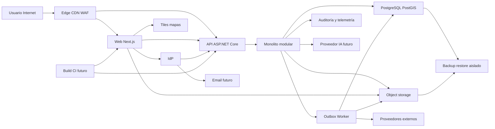

# AgropecuarIA — threat model central

## Executive summary

AgropecuarIA está todavía en discovery: el repositorio no contiene un runtime productivo, sino arquitectura objetivo y spikes R0 aislados y descartables (`README.md`, “Estado”; `tasks/release-plan.md`, “R0”). El mayor riesgo futuro es una fuga entre organizaciones a través de API, RLS, jobs, cache, archivos, exportes o recuperación de IA; le siguen toma de cuenta, abuso privilegiado, archivos hostiles, integraciones no confiables, pérdida de integridad transaccional y recuperación incompleta. Ningún control demostrado por un spike se considera desplegado: cada superficie queda bloqueada hasta reproducir su mitigación y pruebas en el slice productivo correspondiente (`tasks/risk-register.md`; `tasks/evidence/AGRO-FND-001/README.md`).

## Scope and assumptions

### Alcance

- Arquitectura objetivo: aplicación Next.js/React separada, API/BFF ASP.NET Core, monolito modular, worker, PostgreSQL/PostGIS, object storage privado y proveedores externos (`docs/05-arquitectura.md`, “Decisión principal” y “Stack de referencia”).
- Límites y flujos entre los 15 módulos documentados, incluyendo Identity/Tenancy, Documents, Audit/Compliance, Integrations y Analytics/AI (`tasks/evidence/AGRO-FND-001/module-boundaries.json`; `tasks/evidence/AGRO-FND-001/consumer-map.json`).
- Datos, identidad, archivos, GIS/clima, IA, telemetría, backup/restore, build y futura promoción de artefactos (`docs/07-seguridad-y-privacidad.md`; `tasks/release-plan.md`).
- Evidencia R0 bajo `tasks/evidence/` solo como fuente de hipótesis y controles a reproducir. Los fixtures son sintéticos y los prototipos no se reutilizan sin una revisión de implementación (`README.md`; `tasks/release-plan.md`, “R0”).

### Fuera de alcance

- Certificación legal, dictamen AAIP, aprobación contractual de proveedor, selección de región, DPA o plazos legales de retención (`tasks/decisions-and-gaps.md`, `VAL-LEG` y `GAP-003`).
- ARCA, offline, mapas descargables, Kubernetes, microservicios y herramientas de IA con autoridad de escritura (`docs/01-vision-y-alcance.md`; `docs/05-arquitectura.md`; `docs/08-estrategia-ia.md`).
- Afirmar controles productivos, SLA, RPO/RTO o exposición de red reales donde solo existen especificaciones o laboratorios locales (`tasks/evidence/AGRO-DIS-005/validation-report.md`; `tasks/evidence/AGRO-DIS-007/validation-report.md`).

### Supuestos explícitos y preguntas abiertas

- Se asume un SaaS web expuesto a Internet y online-only, con usuarios autenticados y organizaciones aisladas; el hosting y edge definitivos no están elegidos (`docs/05-arquitectura.md`; `tasks/release-plan.md`).
- `Organization` es el tenant operativo y el servidor deriva tenant, actor y permisos; CUIT no selecciona contexto (`docs/adr/ADR-009-limites-modulares-y-compatibilidad.md`; `tasks/evidence/AGRO-FND-001/README.md`).
- `Q-054` sigue abierta para el cliente comercial inicial. Cambia escala, abuso administrativo y necesidades de soporte, pero no el aislamiento técnico por organización (`docs/11-preguntas-discovery.md`; `tasks/decisions-and-gaps.md`, defaults de `AGRO-DIS-003`).
- `Q-055` sigue abierta para propiedad/control contractual entre propietario, productor y asesor. Hasta resolución, membresía no implica transferencia de propiedad ni acceso entre clientes (`docs/11-preguntas-discovery.md`; `tasks/decisions-and-gaps.md`, `GAP-008`).
- `Q-058` sigue abierta para proveedor internacional y región de procesamiento. Toda transferencia o proveedor afectado queda en NO-GO productivo hasta `VAL-LEG` (`docs/11-preguntas-discovery.md`; `tasks/decisions-and-gaps.md`, `VAL-LEG`).
- `Q-060` sigue abierta para SLA, soporte y retención. 99,9 %, RPO 15 min y RTO 2 h son targets de ingeniería, no compromisos contractuales (`docs/09-calidad-y-pruebas.md`; `tasks/decisions-and-gaps.md`, defaults de `AGRO-DIS-007`).

Estas preguntas no fueron cerradas por el sponsor en este gate R0. Elevan la incertidumbre de TM-009, TM-011, TM-013 y TM-014 y prohíben certificar Legal, proveedor o producción.

## System model

### Primary components

**Runtime futuro.** Navegador/PWA Next.js; API/BFF ASP.NET Core; módulos de dominio dentro de un monolito; worker con outbox/inbox; PostgreSQL/PostGIS; object storage privado; IdP; proveedores GIS, clima, correo y, en R6, IA (`docs/05-arquitectura.md`; `tasks/release-plan.md`). Los módulos poseen sus schemas y solo consumen contratos públicos; ningún módulo puede consultar persistencia ajena (`docs/adr/ADR-009-limites-modulares-y-compatibilidad.md`; `tasks/evidence/AGRO-FND-001/module-boundaries.json`).

**Build, CI y desarrollo.** Los spikes usan .NET y frontends Next.js aislados con lockfiles propios. No existe todavía solución productiva raíz, pipeline, identidad de CI, registro de artefactos ni deploy (`README.md`; `tasks/evidence/AGRO-DIS-007/validation-report.md`). Estas superficies son developer-controlled hasta que `AGRO-PLT-001/002` cree el camino de promoción.

**Tests y ejemplos.** Los spikes R0 prueban contratos con fixtures sintéticos, servicios efímeros y endpoints locales; no son controles runtime ni componentes a desplegar (`tasks/evidence/AGRO-DIS-003/validation-report.md`; `tasks/evidence/AGRO-DIS-004/validation-report.md`; `tasks/evidence/AGRO-DIS-005/validation-report.md`).

### Data flows and trust boundaries

- **Internet/usuario → edge/CDN/WAF → navegador y API:** IP, headers, cookies, rutas, assets públicos, formularios y respuestas por HTTPS futuro. Se requieren TLS/origin lockdown, CSP, CSRF/origin, CORS, cookies `HttpOnly`/`Secure`/`SameSite`, clickjacking protection, límites y cache keys que nunca mezclen tenants; no hay edge productivo que los demuestre aún (`docs/05-arquitectura.md`, “Vista de contenedores”; `docs/07-seguridad-y-privacidad.md`, “Aplicación y API”).
- **Navegador → API:** sesión, comandos y consultas REST/JSON/OpenAPI. La API debe derivar el tenant, validar schema/tamaño, autorizar recurso/acción/estado, limitar tasa y reautorizar antes de ETag; el spike de identidad solo valida el contrato local (`docs/adr/ADR-009-limites-modulares-y-compatibilidad.md`; `tasks/evidence/AGRO-DIS-003/validation-report.md`).
- **Navegador ↔ IdP → API/servicio de email:** OIDC Authorization Code + PKCE, linking, recovery, claims y links/tokens opacos. Callbacks y webhooks de entrega requieren origen, firma, timestamp y replay protection; sandbox, DPA/región, plantillas, bounce retention y lifecycle reales siguen pendientes (`tasks/evidence/AGRO-DIS-003/validation-report.md`; `tasks/decisions-and-gaps.md`, `ADR-003`).
- **API/worker → PostgreSQL/PostGIS:** estado tenant, geometrías, historial, outbox/inbox y auditoría por conexión cifrada futura. Se exigen autorización de aplicación, transacción con `SET LOCAL`, `FORCE RLS`, rol sin `BYPASSRLS`, queries parametrizadas y ownership por schema; hoy solo hay probes efímeros (`docs/05-arquitectura.md`, “Multi-tenancy”; `tasks/evidence/AGRO-DIS-003/validation-report.md`).
- **API → grant; navegador → object storage; storage/scanner → worker/API:** binarios, hashes, metadata, grants, eventos y verdicts cruzan dos fronteras directas. Se exigen autorización antes de emitir y consumir el grant, cuarentena privada, MIME/tamaño/hash, único verdict `clean`, grants breves ligados a tenant/recurso y reconciliación; proveedor, KMS, WORM y scanner productivos no están aprobados (`docs/07-seguridad-y-privacidad.md`; `tasks/evidence/AGRO-DIS-005/validation-report.md`).
- **Navegador → proveedor de tiles/style:** IP, viewport y zona solicitada salen directamente a un host allow-listed bajo CSP; no se envían tenant, nombre de campo ni polígono completo. Términos, región/logs, minimización y fallback tabular siguen siendo gates (`tasks/evidence/AGRO-DIS-004/source-and-license-matrix.md`; `tasks/evidence/AGRO-SEC-001/provider-processing-inventory.md`, `PI-04`).
- **Worker ↔ proveedores GIS/clima/webhooks:** coordenadas minimizadas, GeoJSON, XML CAP, NetCDF, snapshots y checkpoints por endpoints fijados. Se requieren allow-list, límites de redirects/DNS, schema/unidades/frescura, autenticidad, idempotencia y fallback; las pruebas live R0 no prueban SLA ni canal productivo (`tasks/evidence/AGRO-DIS-004/validation-report.md`; `docs/06-integraciones-y-normativa.md`).
- **API/worker ↔ proveedor IA:** prompts, paquetes mínimos de evidencia y respuestas solo en R6. Debe reautorizarse antes y después, usar tools read-only, cálculo determinístico, abstención y kill switch; proveedor, región, retrieval y evals no existen aún (`docs/08-estrategia-ia.md`; `tasks/release-plan.md`, “R6”).
- **Runtime → telemetría/auditoría:** métricas, trazas, logs y eventos append-only. Telemetría admite dimensiones allow-list y tenant seudonimizado, nunca payload/secretos; auditoría es evidencia de negocio separada. No hay SDK/backend/retención productivos (`docs/05-arquitectura.md`, “Operación”; `docs/07-seguridad-y-privacidad.md`, “Auditoría”).
- **Runtime → backup → restore aislado:** DB/PostGIS, objetos y cadena de auditoría. Se requieren PITR, inmutabilidad, principals separados, manifests y reconciliación; solo existe un drill local sintético y el RPO administrado no está probado (`tasks/evidence/AGRO-DIS-005/validation-report.md`; `tasks/backlog/EPIC-16-plataforma-observabilidad-operacion.md`, `AGRO-PLT-004`).
- **Developer/registro de paquetes → build/CI futuro → artefacto:** código, paquetes, lockfiles, secretos de pipeline y artefactos OCI. Deben existir instalación frozen, SAST/SCA/SBOM/secrets, provenance y credenciales de mínimo privilegio; el pipeline productivo no existe (`docs/07-seguridad-y-privacidad.md`; `tasks/backlog/EPIC-16-plataforma-observabilidad-operacion.md`, `AGRO-PLT-002`).

#### Diagram

## Assets and security objectives

| Asset | Why it matters | Security objective (C/I/A) |
|---|---|---|
| Identidades, bindings, factores y sesiones | Una toma de cuenta habilita acceso y acciones en nombre del usuario | C/I/A |
| Datos tenant de producción, inventario y finanzas | Una fuga o alteración puede causar daño comercial y decisiones erróneas | C/I/A |
| Ubicación, geometrías y productividad | Revelan operación física y condicionan cálculos/historia | C/I/A |
| Documentos y archivos originales | Pueden contener datos personales/fiscales y payload hostil | C/I/A |
| Catálogo, perfiles, clima y alertas oficiales | Su integridad/frescura afecta reglas y recomendaciones a escala | I/A |
| Evidencia y recomendaciones de IA | Deben ser autorizadas, explicables y nunca fuente de cálculo crítico | C/I/A |
| Outbox/inbox, versiones y hechos históricos | Sostienen exactly-once, rectificación y trazabilidad temporal | I/A |
| Auditoría de negocio y seguridad | Permite atribución, detección, investigación y cumplimiento | C/I/A |
| Secretos, tokens, claves y credenciales de proveedor | Su exposición cruza fronteras y puede comprometer todos los tenants | C/I |
| Backups, manifests y claves de recuperación | Son la última defensa frente a corrupción o ransomware | C/I/A |
| Código, dependencias y artefactos de release | Un artefacto comprometido distribuye el ataque al runtime | I/A |
| Presupuesto, cuotas y capacidad online | El producto no tiene modo offline y depende de disponibilidad controlada | A |

Evidencia: clasificación y objetivos en `docs/07-seguridad-y-privacidad.md`; invariantes de datos en `docs/04-reglas-y-modelo-de-datos.md`; ownership en `tasks/evidence/AGRO-FND-001/module-boundaries.json`.

## Attacker model

### Capabilities

- Atacante remoto anónimo capaz de explorar superficies públicas, automatizar recovery/login, enviar inputs malformados y consumir cuota cuando exista exposición (`docs/07-seguridad-y-privacidad.md`).
- Miembro autenticado de un tenant que conoce o adivina identificadores, sube archivos, fuerza concurrencia/reintentos y busca datos de otra organización (`tasks/risk-register.md`, `RSK-001/012/016`).
- Proveedor, webhook, feed o contenido comprometido capaz de entregar payloads válidos semánticamente falsos, stale, enormes o con prompt injection (`tasks/risk-register.md`, `RSK-009/010/017`).
- Administrador, operador o cuenta de desarrollo/CI comprometida con privilegios superiores a un usuario común (`docs/07-seguridad-y-privacidad.md`, “Amenazas y controles”).
- Mantenedor malicioso o paquete comprometido capaz de influir en el build futuro (`tasks/risk-register.md`, `RSK-026`).

### Non-capabilities

- No se asume acceso físico al datacenter, ruptura de TLS/criptografía fuerte ni control previo del host cloud; estos escenarios se reevalúan al elegir plataforma.
- No se asume que un usuario pueda suministrar URLs arbitrarias, ejecutar tools de IA o acceder a soporte JIT: esas capacidades están prohibidas o fuera del MVP (`docs/07-seguridad-y-privacidad.md`; `tasks/decisions-and-gaps.md`, defaults de `AGRO-DIS-003`).
- Los endpoints, bases y UIs de `tasks/evidence/` no se modelan como Internet-facing ni productivos; un fallo del spike solo eleva una hipótesis hasta reproducirla en el runtime (`README.md`; cada `validation-report.md`).
- ARCA, offline y credenciales reales no existen en el alcance actual (`docs/01-vision-y-alcance.md`; `tasks/release-plan.md`).

## Entry points and attack surfaces

| Surface | How reached | Trust boundary | Notes | Evidence (repo path / symbol) |
|---|---|---|---|---|
| Edge, CDN, WAF y cache | Internet, web y API | Internet → edge → origen | TLS, origin lockdown, CSP/CSRF/CORS/cookies, rate limit y cache tenant-safe | `docs/05-arquitectura.md`; `docs/07-seguridad-y-privacidad.md` |
| Login, callback, linking y recovery | Navegador/IdP | Internet y tercero → identidad | Anti-enumeración, PKCE, step-up, one-shot y revocación deben probarse con IdP real | `tasks/evidence/AGRO-DIS-003/validation-report.md` |
| Email de verificación/recovery y webhooks | IdP/API/proveedor | Identidad ↔ tercero de entrega | Token opaco, template/header injection, firma/replay, bounce retention y outage neutral | `tasks/evidence/AGRO-SEC-001/provider-processing-inventory.md`, `PI-07` |
| REST/JSON API futura | Web o cliente autenticado | Internet → API | Validación, rate limit, tenant derivado y authz por recurso/estado | `docs/05-arquitectura.md`; `docs/07-seguridad-y-privacidad.md` |
| Mutaciones y búsquedas por ID | API | API → módulos/DB | BOLA, ETag, concurrencia, paginación y errores no enumerantes | `docs/adr/ADR-009-limites-modulares-y-compatibilidad.md` |
| Upload/download y grants | Web/API | Usuario → cuarentena → storage | MIME/hash/tamaño, scanner fail-closed, grant tenant/recurso | `tasks/evidence/AGRO-DIS-005/validation-report.md` |
| Tiles y estilos de mapa | Navegador | Browser → proveedor tercero | CSP/connect-src, hosts fijos, atribución, IP/viewport minimizados y fallback tabular | `tasks/evidence/AGRO-DIS-004/source-and-license-matrix.md` |
| Geometría, XML CAP y NetCDF | API/worker/proveedor | Input no confiable → parser/PostGIS | Vértices, SRID, DTD, tamaño, memoria, tiempo y lifecycle | `tasks/evidence/AGRO-DIS-004/validation-report.md` |
| Adapters HTTP y webhooks | Worker/API | Runtime ↔ proveedor | SSRF, redirects, DNS, firma, freshness, replay y schema drift | `docs/06-integraciones-y-normativa.md`; `tasks/risk-register.md` |
| Jobs, outbox e inbox | Scheduler/evento | Cola lógica → worker → datos | Tenant efectivo, leasing, idempotencia, orden y poison | `docs/05-arquitectura.md`; `docs/adr/ADR-009-limites-modulares-y-compatibilidad.md` |
| Retrieval, prompts y tools IA | API/documentos/proveedor | Contenido no confiable → AI gateway | R6, read-only, autorización posterior, evals y kill switch | `docs/08-estrategia-ia.md` |
| Administración, editorial y exportes | Usuario privilegiado | Privilegio humano → API/datos | Step-up, segregación y auditoría inmutable | `docs/07-seguridad-y-privacidad.md`; `tasks/team-workstreams.md` |
| Logs, trazas, métricas y auditoría | Runtime/operator | Runtime → sistemas operativos | Redacción, allow-list, acceso/retención y no alta cardinalidad | `docs/07-seguridad-y-privacidad.md`; `tasks/evidence/AGRO-DIS-007/validation-report.md` |
| Restore y break-glass | SRE/Data | Backup/operator → entorno aislado | Inmutabilidad, claves separadas, reconciliación y audit | `tasks/evidence/AGRO-DIS-005/validation-report.md` |
| Dependencias y pipeline futuro | Registro/desarrollador | Supply chain → CI → artefacto | Lockfiles, scripts, secrets, provenance y permisos | `docs/07-seguridad-y-privacidad.md`; `tasks/backlog/EPIC-16-plataforma-observabilidad-operacion.md` |

## Top abuse paths

1. **Exfiltración cross-tenant:** un miembro de A obtiene un ID de B, fuerza una ruta API/job/cache/archivo que confía en el ID del cliente, evita la reautorización y recupera datos o existencia de B; impacto: fuga multiempresa (TM-001).
2. **Toma de cuenta por web/linking/recovery:** XSS/CSRF/cookie o email/webhook inseguro permite robar/reusar sesión/proof; el atacante vincula una identidad sin doble reautenticación y entra a tenants de la víctima; impacto: control de cuenta y recursos (TM-002).
3. **Archivo hostil publicado:** un uploader falsifica MIME/verdict o reutiliza un grant directo navegador→storage sin binding tenant/recurso, mueve un objeto fuera de cuarentena y entrega malware o contenido ajeno; impacto: ejecución en dispositivo y fuga documental (TM-003).
4. **Dato externo confiado indebidamente:** proveedor/feed cambia schema, envía CAP replay/stale o dato meteorológico alterado; parser lo acepta, snapshot/recomendación lo presenta como vigente; impacto: decisión operativa insegura (TM-004).
5. **Agotamiento, egress y privacidad encadenados:** geometría/XML/NetCDF fuerza CPU/memoria, una URL/redirect alcanza metadata/red interna o tiles reciben una zona más precisa de lo necesario; el atacante roba credenciales, degrada workers o expone ubicación (TM-005, TM-006, TM-013).
6. **Prompt injection con autoridad excesiva:** documento o payload proveedor instruye al modelo para recuperar otro recurso o invocar una tool; falta authz posterior y se exfiltran datos o se presenta una recomendación no fundamentada (TM-007).
7. **Abuso privilegiado y borrado de huellas:** operador extrae datos o altera permisos y luego modifica/omite auditoría; impacto: fuga/fraude no atribuible (TM-009).
8. **Compromiso de build:** paquete/script o credencial de CI comprometidos generan un artefacto malicioso sin provenance; impacto: compromiso transversal de runtime y secretos (TM-010).
9. **Ransomware con restore falso:** principal comprometido cifra DB/objetos y backups mutables; restore incompleto pierde geometrías, objetos o cadena audit; impacto: indisponibilidad y corrupción histórica (TM-011).
10. **Retry/concurrencia duplica hechos:** dos comandos o un evento replay atraviesan ventanas distintas, duplican stock/costo o sobrescriben un confirmado; impacto: integridad financiera/productiva y auditoría inconsistente (TM-012).

## Threat model table

| Threat ID | Threat source | Prerequisites | Threat action | Impact | Impacted assets | Existing controls (evidence) | Gaps | Recommended mitigations | Detection ideas | Likelihood | Impact severity | Priority |
|---|---|---|---|---|---|---|---|---|---|---|---|---|
| TM-001 | Miembro autenticado o job confundido | Existe una ruta tenant que acepta ID/contexto sin reautorizar | Cruza tenant por API, RLS, job, cache, archivo, exporte o retrieval | Fuga o alteración multiempresa | Datos tenant, archivos, ubicación, auditoría | Contrato: tenant derivado, authz default-deny y `FORCE RLS`; evidencia solo R0 (`docs/05-arquitectura.md`; `tasks/evidence/AGRO-DIS-003/validation-report.md`) | Ninguna ruta productiva fue probada | **Owner AppSec + Identity:** authz por recurso antes de lookup, claves tenant, RLS/pool/job fail-closed; `TST-TENANT-NEG`, BOLA en toda ruta y test de reutilización de conexión | Métrica redactada de denegaciones y alerta de invariantes cross-tenant | high | high | critical |
| TM-002 | Atacante remoto con email/proof/sesión comprometidos | Edge/web/email o linking/recovery carece de aislamiento, one-shot o step-up | Usa XSS/CSRF/cookie/webhook, toma cuenta, vincula identidad o conserva sesión revocada | Acceso privilegiado a tenants | Bindings, factores, sesiones, datos | PKCE, doble proof, anti-enumeración y revocación demostrados solo localmente; CSP/CSRF/CORS/cookies son targets (`tasks/evidence/AGRO-DIS-003/validation-report.md`; `docs/07-seguridad-y-privacidad.md`) | Sin edge, headers/cookie policy, IdP/email, DPA/región ni lifecycle real | **Owner Identity + AppSec:** issuer/audience/nonce/PKCE, CSP/CSRF/CORS/cookies/clickjacking, template/header, webhooks, doble reauth, TTL/replay y revocación; tests web, race, replay, enumeración y factor perdido | Rate/anomalía de sesión/recovery/linking y auditoría redactada de revocación | medium | high | critical |
| TM-003 | Uploader, scanner o receptor de grant malicioso | Grant directo browser→storage no liga tenant-recurso-verdict | Publica archivo hostil, suplanta scan o reutiliza acceso | Malware, fuga y compromiso de storage | Archivos, metadata, credenciales, dispositivos | Cuarentena fail-closed, hash y grants breves probados solo con fixtures (`tasks/evidence/AGRO-DIS-005/validation-report.md`) | Sin scanner/KMS/WORM/sandbox/límites cloud ni flujo directo probado | **Owner Documents + AppSec:** streaming con límites, allow-list real, scanner aislado, `clean` exacto, grant one-shot ligado/reautorizado antes de upload/download; polyglot/bomb/fallo scanner/BOLA tests | Backlog/verdicts de cuarentena y anomalías de grants sin tokens/nombres | medium | high | critical |
| TM-004 | Proveedor/feed/intermediario comprometido | Runtime confía en payload, freshness o schema sin validación | Inyecta dato alterado, stale, replay o schema drift | Alertas/recomendaciones incorrectas | Snapshots, CAP, evidencia, seguridad operativa | Schema/unidades/frescura y lifecycle CAP demostrados en R0 (`tasks/evidence/AGRO-DIS-004/validation-report.md`) | Canal/autenticidad, cuota, replay durable y contrato pendientes | **Owner Weather + SRE:** schema estricto, firma/canal cuando exista, checkpoint/replay, freshness y abstención; contract/lifecycle/degradación tests | Rechazos de schema, freshness y anomalías de lifecycle/proveedor | medium | high | high |
| TM-005 | Usuario o fuente comprometida | Parser acepta payload complejo sin presupuesto | Geometry/XML/NetCDF consume CPU/memoria o corrompe estado | DoS y área/historia errónea | API, worker, PostGIS, geometrías | Límites SRID/vértices/validez y parsers acotados solo en spike (`tasks/evidence/AGRO-DIS-004/validation-report.md`) | Sin cuotas, timeouts e aislamiento productivos | **Owner GIS + AppSec:** límite bytes/vértices/dimensiones, DTD off, streaming, timeout/query budget y validación antes de persistir; property y resource-budget tests | Rechazos por tamaño, timeout, memoria y latencia parser | medium | high | high |
| TM-006 | Usuario, webhook, email/mapa o config proveedor maliciosos | URL/redirect/DNS, connect-src, template o replay no restringido | Alcanza red interna, filtra zona a tiles o duplica efecto inbound | Robo de credenciales, ubicación, pivot y corrupción | Red interna, secretos, ubicación, integridad | URLs fijas y política allow-list/idempotente solo documental/R0 (`docs/07-seguridad-y-privacidad.md`; `tasks/risk-register.md`) | Sin egress gateway, CSP productiva, DNS policy ni inbox durable | **Owner Integrations + AppSec:** destinos por adapter, CSP/connect-src, minimización tiles, templates cerrados, resolver/validar cada salto, bloquear IP reservada, firma+timestamp+inbox; tests loopback/rebinding/redirect/tiles/header/replay | Destinos denegados y alertas de firma/replay sin ubicación/payload | medium | high | high |
| TM-007 | Usuario, documento, upstream o modelo comprometido | IA ingiere contenido no confiable y posee retrieval/tool excesivo | Prompt injection evade policy, cruza tenant o ejecuta acción | Fuga y recomendación insegura | Datos tenant, tool authority, evidencia | Objetivo read-only, cálculo determinístico, evidencia/abstención (`docs/08-estrategia-ia.md`) | No existen provider, retrieval, evals ni kill switch runtime | **Owner AI + AppSec:** retrieval pre/post-authz, tool allow-list read-only, paquetes mínimos, output validation, eval/red-team y kill switch por caso/tenant | Denegaciones de tool, violaciones de policy, regresión de evals | high | high | critical |
| TM-008 | Error de desarrollo, collector u operador | Telemetría acepta payload/IDs o acceso amplio | Exfiltra PII, CUIT, coordenadas, documentos o secretos | Violación de privacidad y credenciales | PII, ubicación, secretos, identidad tenant | Política allow-list y tenant seudonimizado probada solo con datos sintéticos (`tasks/evidence/AGRO-DIS-007/validation-report.md`) | Sin emisión end-to-end, backend, acceso ni retención | **Owner Platform + Privacy:** schema allow-list, redaction en source/exporter, RBAC/retención y canaries; test `TST-OTEL-REDACTION`, secretos/PII y cardinalidad | Scan automático de muestras y alertas de cardinalidad/exporter | medium | high | high |
| TM-009 | Insider o sesión privilegiada robada | Admin/export/audit carece de step-up o segregación | Abusa acceso y altera/omite evidencia | Fuga/fraude sin atribución | Datos, roles, exportes, auditoría | Default-deny, step-up y audit append-only son requisitos; soporte JIT apagado (`docs/07-seguridad-y-privacidad.md`; `tasks/decisions-and-gaps.md`) | Sin SoD, store inmutable ni canal IR productivos | **Owner AppSec + Audit/Compliance:** permisos finos, step-up, dual control, audit append-only/WORM y break-glass; tests de admin/export/tamper/consent | Alertas de acción privilegiada, acceso masivo e integridad de cadena | medium | high | critical |
| TM-010 | Paquete, cuenta dev o CI comprometidos | Build ejecuta dependencia/script o usa secreto amplio | Inserta código malicioso o roba credenciales | Compromiso transversal del runtime | Código, artefactos, secretos, tenants | Versiones/locks y scans existen solo por spike; gates futuros especificados (`docs/07-seguridad-y-privacidad.md`) | Sin pipeline raíz, OIDC CI, SBOM/provenance/firma | **Owner Platform + AppSec:** frozen installs, mínimo privilegio/OIDC, protected reviews, SAST/SCA/SBOM/secrets, artifact signing/provenance; `TST-SEC-GATES` | Alertas SCA/secret y rechazo de provenance | medium | high | critical |
| TM-011 | Ransomware, principal cloud u operador comprometido | Backup mutable, misma credencial o restore sin reconciliar | Destruye primario/backups o restaura conjunto inconsistente | Pérdida histórica e indisponibilidad | DB/PostGIS, objetos, audit, claves | PITR/WORM objetivo y drill local sintético con manifest (`tasks/evidence/AGRO-DIS-005/validation-report.md`) | PITR/immutability/region/volumen/key recovery no probados | **Owner SRE + Data:** principals separados, backup inmutable, PITR, inventario DB+objetos+audit y restore aislado; `TST-RESTORE`, corrupción, claves y roll-forward | Edad/inmutabilidad de backup, RPO/RTO y divergencia de restore | medium | high | critical |
| TM-012 | Retry, usuario concurrente o evento atrasado | Falta idempotencia, ETag, atomicidad u orden | Duplica efecto, pisa confirmado o deja parcial | Stock/costo/historia incorrectos | Hechos, outbox/inbox, auditoría | ADR-009 define ETag, N/N-1, orden y rectificación; sin runtime (`docs/adr/ADR-009-limites-modulares-y-compatibilidad.md`) | Sin primer recurso, ledger/outbox ni migration drill | **Owner Architecture + Data:** key+fingerprint, negocio+outbox atómico, inbox, ETag fuerte y rectificación; tests concurrencia/crash/replay/N-1 | Conflictos, dedupe, gaps, poison y conciliación | high | high | high |
| TM-013 | Configuración, tiles/proveedor u operador | Roles legales, minimización, región o retención no aprobados | Procesa/transfiere/retiene/restaura datos o viewport/zona fuera de autorización | Daño a titulares y exposición legal | Datos personales/fiscales, ubicación, documentos | Minimización, no-training y legal hold son política objetivo (`docs/07-seguridad-y-privacidad.md`) | Q-054/055/058/060, DPA, regiones y plazos abiertos | **Owner Privacy + Legal:** data-flow record, minimizar tile/coordinate, finalidad aprobada, DPA/subencargados/región, retención y rights/hold/purge/restore tests; gate `VAL-LEG` | SLA de derechos, reconciliación purge/restore y cambios de inventario/proveedor | medium | high | high |
| TM-014 | Abusador, hot tenant o proveedor caído | Sin cuotas/rate limits/cache key/budget o degradación | Agota capacidad/cuota/costo, envenena cache o mezcla respuesta tenant en un camino online-only | Indisponibilidad, fuga por cache o gasto descontrolado | Edge, API, worker, cuotas, presupuesto | Estados degradados y modelo sintético fail-closed (`tasks/evidence/AGRO-DIS-007/validation-report.md`) | Edge/cache, carga, conectividad, cuotas, costos y alertas reales no medidos | **Owner SRE + Product:** origin lockdown, cache público explícito y tenant-safe, quotas por actor/tenant, rate limits, circuit breaker, presupuestos; tests cache poisoning/cross-tenant/load/degradación | Cache anomalies, rate/quota/cost/dependency health y error-budget burn | high | medium | high |

## Criticality calibration

- **Critical:** compromete múltiples tenants, control de cuenta/privilegio, cadena de suministro o recuperación integral, o permite una acción de IA insegura sin control humano. Ejemplos: BOLA cross-tenant (TM-001), account takeover (TM-002), auditoría privilegiada manipulable (TM-009).
- **High:** impacto alto confinado a una capacidad/tenant o indisponibilidad/costo serio, con condiciones realistas pero mitigación/fallback posible. Ejemplos: feed climático alterado y fail-open (TM-004), parser GIS agotando workers (TM-005), telemetría con ubicación/PII (TM-008).
- **Medium:** exposición parcial de datos de baja sensibilidad, DoS acotado o fallo que requiere acceso privilegiado adicional y se detecta/revierte sin perder hechos. Ejemplos futuros: endpoint autenticado con rate limit imperfecto pero cuota dura; metadata operativa no sensible en un error; retraso recuperable de un job sin pérdida.
- **Low:** hallazgo de baja sensibilidad, sin cruce de tenant ni integridad crítica, con prerrequisitos improbables y recuperación trivial. Ejemplos futuros: fingerprint de versión sin información útil; ruido en logs locales sintéticos; DoS de una vista no crítica con límite upstream.

La prioridad de TM-001/002/003/007/009/010/011 permanece crítica aunque exista evidencia R0, porque no hay control integrado en runtime. La probabilidad y prioridad se recalibran con hosting, IdP, volumen, roles contractuales y retención resueltos.

## Focus paths for security review

| Path | Why it matters | Related Threat IDs |
|---|---|---|
| `docs/05-arquitectura.md` | Define edge/CDN/WAF, componentes, límites, multi-tenancy, persistencia y runtime objetivo | TM-001, TM-002, TM-005, TM-006, TM-008, TM-011, TM-014 |
| `docs/07-seguridad-y-privacidad.md` | Fuente principal de clasificación, auth, API, archivos, IA, privacidad y auditoría | TM-001–TM-003, TM-006–TM-011, TM-013 |
| `docs/08-estrategia-ia.md` | Delimita autoridad, evidencia, tools y abstención de IA | TM-007, TM-013 |
| `docs/adr/ADR-009-limites-modulares-y-compatibilidad.md` | Fija scopes, errores, ETag, N/N-1, eventos y reautorización | TM-001, TM-012 |
| `tasks/evidence/AGRO-FND-001/module-boundaries.json` | Registro machine-readable de owners, schemas y scopes por agregado | TM-001, TM-009, TM-012 |
| `tasks/evidence/AGRO-FND-001/consumer-map.json` | Mapea puertos, consumidores, reautorización y telemetría permitida | TM-001, TM-008, TM-012 |
| `tasks/evidence/AGRO-DIS-003/` | Evidencia R0 de identidad, recovery, sesión y RLS que debe revalidarse en R1 | TM-001, TM-002, TM-009 |
| `tasks/evidence/AGRO-DIS-004/` | Parsers, PostGIS y contratos proveedor con límites todavía no productivos | TM-004, TM-005, TM-006, TM-014 |
| `tasks/evidence/AGRO-DIS-005/` | Contratos de archivo, grants, cuarentena y restore local | TM-003, TM-011, TM-013 |
| `tasks/evidence/AGRO-DIS-007/` | Modelo sintético de capacidad, conectividad y telemetría allow-list | TM-008, TM-014 |
| `tasks/risk-register.md` | Riesgos, owners, disparadores y mitigaciones transversales | TM-001–TM-014 |
| `tasks/decisions-and-gaps.md` | Distingue defaults técnicos de decisiones externas/legales pendientes | TM-002, TM-003, TM-004, TM-008, TM-011, TM-013, TM-014 |
| `tasks/backlog/EPIC-15-seguridad-privacidad.md` | Convierte amenazas en gates SEC-001–004 y pruebas futuras | TM-001–TM-014 |
| `tasks/backlog/EPIC-16-plataforma-observabilidad-operacion.md` | Define pipeline, observabilidad y recovery aún no implementados | TM-008, TM-010, TM-011, TM-014 |

## Quality check

- [x] Se cubrieron todas las entradas descubiertas: edge/web, identidad/email, API, grants directos a storage, tiles, parsers/GIS, proveedores/webhooks, jobs, IA, admin/export, telemetría, restore y supply chain.
- [x] Cada frontera del modelo aparece al menos en una amenaza.
- [x] Runtime futuro, build/CI/dev y spikes/tests R0 están separados explícitamente.
- [x] Q-054/055/058/060 quedan visibles como supuestos abiertos que alteran ranking y gates.
- [x] Cada amenaza crítica/alta tiene owner, mitigaciones específicas, pruebas y detección.
- [x] Ninguna evidencia R0 se presenta como control productivo, y no se certifican Legal, proveedor, SLA ni deploy.
